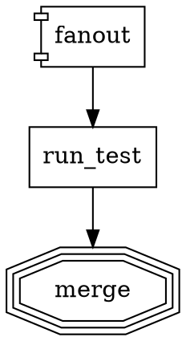

# Sprint Summary — 2026-03-04

## What Was Built

Four improvements across two packages (`attractor` and `attractor-lsp`):

1. **Parallel flow visibility in default CLI output** — parallel events now display without `--verbose`
2. **Dynamic runtime parallelization via `foreach_key`** — spawn one branch per array item at runtime
3. **Formatter: preserve up to one blank line of user whitespace** — blank lines within sections are maintained
4. **Formatter: vertical alignment** — IDs, arrows, and `=` signs align across blocks of consecutive statements

Two bugs were also found and fixed during integration testing:
- **BUG-A01**: template edge routing on `executeDynamic` failure (propagated via `suggestedNextIds: []`)
- **BUG-A02**: `FanInHandler` crashed on empty array input (0-branch dynamic parallel)

---

## Key Implementation Decisions & Trade-offs

### Parallel visibility (CLI)
- Three new `formatEvent` cases added to `cli.ts`: `parallel_started`, `parallel_branch_completed`, `parallel_completed`
- Format: `⊞` glyph as visual indicator; branch output shows `├` prefix and `N/total` counter
- `totalBranches` field added to the `parallel_branch_completed` event type so formatters can display progress
- `cc_event` verbose formatting extracts: message type, subtype, model, token counts (input/output/cache), duration, and cost — provides actionable debug output instead of the bare event kind

### Dynamic parallel (`foreach_key`)
- **Node cloning approach**: synthetic nodes/edges are injected into the graph during execution and removed after. This reuses the existing worker pool and branch execution logic without branching the runner.
- **`suggestedNextIds: []` for infrastructure failures**: the empty array signals to the runner to stop traversal entirely (vs. `undefined`, which falls through to normal edge selection). This prevents the runner from following the template edge after a failed fanout.
- **`item_key` default**: if not specified on the node, defaults to `"item"`. Each branch clone receives its own context copy with `item_key` set to the current array element.
- **Cleanup**: synthetic nodes and edges are removed from `graph.nodes`/`graph.edges` after execution, keeping the graph clean for any post-run inspection.
- **Validation rule** (`foreachKeyValidRule`): warns if `foreach_key` is on a non-`component` node, or if it has ≠ 1 outgoing edge. These are warnings, not errors, matching existing rule severity conventions.

### Formatter: blank line preservation
- `startLine`/`endLine` fields added to all `CstStmt` variants; `CstParser.advance()` tracks `lastLine`
- `hadBlankLineBetween(a, b)` checks `b.startLine - a.endLine >= 2` — blank line detected from source positions
- Within each section, consecutive statements use `"\n\n"` if a gap existed, `"\n"` otherwise
- Multiple consecutive blank lines collapse to one (spec requirement)

### Formatter: vertical alignment
- `splitBlocks()` splits a section's items at blank-line boundaries, returning alignment blocks
- Each block type has its own emitter (`emitGraphAttrBlock`, `emitNodeBlock`, `emitEdgeBlock`, `emitDefaultsBlock`)
- Node alignment: IDs padded to `maxIdLen`; per-attribute-position key padding for `=` alignment
- Edge alignment: per-column `maxNodeLen[c]` for `->` arrow alignment; max chain width for `[` bracket alignment; per-attribute-position key padding
- Alignment only applies within blocks (blank line = block boundary) — this avoids over-alignment across unrelated groups of nodes

---

## Files Created and Modified

### `packages/attractor`

| File | Change |
|------|--------|
| `src/model/events.ts` | Added `totalBranches` field to `parallel_branch_completed` event |
| `src/handlers/parallel.ts` | Added `collectTemplateChain()`, `executeDynamic()` methods; wired into `execute()`; emits `totalBranches`; BUG-A01 fix (`suggestedNextIds: []` on infra failures) |
| `src/handlers/fan-in.ts` | BUG-A02 fix: empty `outcomes` array returns `success` |
| `src/engine/runner.ts` | Added early-exit logic for `suggestedNextIds: []` to stop traversal on fanout failure |
| `src/validation/rules.ts` | Added `foreachKeyValidRule` |
| `src/cli.ts` | Added `formatEvent` cases for 3 parallel events; added them to default output filter; improved `cc_event` verbose formatting |
| `test/cli/cli.test.ts` | 7 new tests for parallel event formatting and cc_event verbose |
| `test/handlers/parallel.test.ts` | 8 new dynamic parallel tests; 3 BUG-A01 assertions added to existing fail cases; 1 empty-array test |
| `test/validation/rules.test.ts` | 3 new `foreachKeyValidRule` tests |
| `test/engine/runner.test.ts` | 2 new integration tests for BUG-A01 scenarios |

### `packages/attractor-lsp`

| File | Change |
|------|--------|
| `src/formatter.ts` | All formatter changes: `startLine`/`endLine` on CST nodes; blank-line detection; `splitBlocks()`; alignment block emitters |
| `test/formatter.test.ts` | 6 new blank-line preservation tests; 7 alignment tests; 7 existing tests updated for aligned output |

---

## How to Use the New Features

### Parallel event visibility
No configuration needed. `parallel_started`, `parallel_branch_completed`, and `parallel_completed` now appear in default (non-verbose) output:
```
[12:00:01] ⊞ fanout → parallel (3 branches)
[12:00:02]   ├ fanout__branch_a → success (branch 1/3)
[12:00:03]   ├ fanout__branch_b → fail (branch 2/3)
[12:00:04]   ├ fanout__branch_c → success (branch 3/3)
[12:00:04] ⊞ fanout → done (2 succeeded, 1 failed)
```

For `cc_event` in verbose mode (`--verbose`):
```
[12:00:01] [cc_event] message_start model=claude-sonnet-4-6 in=0 out=0 cache_read=0 cache_create=0
[12:00:02] [cc_event] content_block_delta text
[12:00:03] [cc_event] message_delta stop_reason=end_turn out=142 cost=$0.0042
```

### Dynamic parallelization (`foreach_key`)



At runtime, `context.test_files` must contain a JSON array (e.g., `["a_test.py","b_test.py","c_test.py"]`). The engine spawns one branch per item, setting `context.test_file` in each branch. Results aggregate via the fan-in node exactly like static parallel.

### Formatter blank line preservation

Place blank lines within a section to group related statements:
```dot
// Input:
node_a [shape="box", prompt="Do A"]

node_b [shape="box", prompt="Do B"]
node_c [shape="box", prompt="Do C"]

// After formatting, the blank line between node_a and node_b is preserved (one line max)
```

### Formatter vertical alignment

The formatter automatically aligns statements within consecutive (no-blank-line) blocks:
```dot
// Before formatting:
short [shape="box", prompt="x"]
a_very_long_name [shape="component", max_parallel="3"]

// After formatting (aligned):
short            [shape = "box",       prompt       = "x"]
a_very_long_name [shape = "component", max_parallel = "3"]
```

Edge chains align arrows:
```dot
node_a    -> node_b         -> node_c
long_name -> another_long   -> end
```

---

## Known Limitations / Future Work

- **`foreach_key` with 0 items**: returns success (BUG-A02 fix) with no branches — this is correct behavior but may surprise users who expect a warning when the array is empty.
- **Dynamic branches not visible in graph visualization**: synthetic nodes are injected and removed at runtime; the `visualize` command shows only the static graph.
- **Template chain must be linear**: `collectTemplateChain` stops at fan-in nodes; branching template chains (multiple outgoing edges from any template node) are not supported and will produce unexpected results.
- **Formatter alignment is per-block**: statements separated by a blank line form separate alignment blocks and are aligned independently. This is by design (aligning across blank lines would be surprising) but means users must remove blank lines to align the full section.
- **`cc_event` verbose output**: token fields emit `0` for absent counts (falsy check on SDK types). This is benign but may appear misleading for events that don't carry token data.
