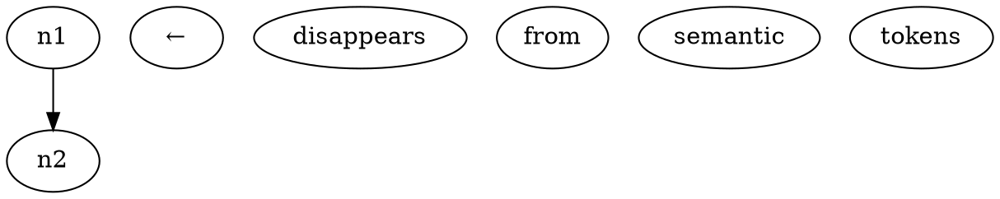

## test_a — 2026-03-06T02:25:12.485Z

## Summary

**test_a complete** — 59/59 integration tests passed, 1 bug found.

**BUG-001**: `hasArrowAhead()` in `semantic-tokens.ts` does not terminate on `EQUALS` tokens. When a bare attribute assignment like `label="Test"` or `goal="..."` appears in a graph/subgraph body on its own line followed by an edge, the function scans across the `= value` into the next line and finds the edge's `->`. This causes:
1. The assignment key (e.g., `label`) to be misclassified as `class[]` (edge source reference)
2. The edge's actual source node (e.g., `n1`) to be silently consumed as "unexpected" inside the edge-chain loop — **completely missing from semantic token output**

**Reproduction:**

**Fix**: Add `if (k === "EQUALS") return false;` to the `hasArrowAhead` terminator set.

All other spec requirements verified correct (token type/modifier mapping, context-dependent modifiers, delta encoding, error resilience, LSP legend, subgraph handling, condition values, large DAGs).

---

## test_a — 2026-03-06T02:42:26.629Z

**Done.** Here's a summary of what I did as `test_a`:

## Results

**Outcome: success — 0 bugs found**

### Validation
- `pnpm run build`: Clean ✓
- `pnpm run typecheck`: Zero errors ✓  
- `pnpm test`: 513 tests pass (442 + 71) ✓

### Integration Testing
Ran two test scripts covering all test_a focus areas:

**`test_a-scratch.mjs`** (59 tests): Comprehensive token mapping, context-dependent modifiers, delta encoding, error resilience, large DAG (500 nodes), legend structure

**`test_a-bug001-v2.mjs`** (44 tests): Targeted BUG-001 fix verification across 6 suites:
1. All bare assignment variants preserve edge source tokens (goal=, label=, default_fidelity=, default_max_retry=, consecutive)
2. All 5 hasArrowAhead terminators (LBRACKET, RBRACE, SEMICOLON, EQUALS, EOF)
3. Subgraph nesting (1-level, 2-level, multiple siblings)
4. Node-decl LBRACKET path regression check
5. Multi-hop edge chains after bare assignments
6. Exact BUG-001 repro boundary conditions

### Findings
**No bugs.** Two pre-existing observations documented in `findings-test_a.md`:
- **OBS-1**: Bare node decl without semicolon before an edge chain — `a\n  a -> b` classifies first `a` as edge source (not declaration) because hasArrowAhead scans across newlines. Workaround: use semicolons.
- **OBS-2**: Edge chains without semicolons bleed across newlines — second chain's source node gets consumed as "unexpected". Both are pre-existing state machine design trade-offs, not regressions from the BUG-001 fix.

---

## test_a — 2026-03-06T02:55:44.511Z

All done. Here's a summary of what I did:

## test_a Results

**Baseline:** Build clean, typecheck zero errors, 515 tests pass.

**Integration Tests:** Wrote `/home/cage/test_a-quoted-duration.mjs` — 79 tests across 6 sections:

1. **Duration regex boundaries** (24 tests) — all 13 valid duration formats (`"30s"`, `"1500ms"`, `"2m"`, `"1h"`, `"1d"`, `"1.5s"`, `"-10s"`, etc.) → `number+readonly`; all 10 invalid strings (`"30"`, `"abc"`, `"30ss"`, `""`, `"30 s"`, `"s"`, etc.) → `string`

2. **All 5 attribute contexts** (10 tests) — `graph [...]`, `node [...]`, `edge [...]`, node decl, edge chain — all produce correct key modifiers AND `number+readonly` values

3. **Non-timeout keys** (7 tests) — `label="30s"`, `weight="5s"`, `TIMEOUT="30s"`, `custom_timeout="10m"`, etc. all remain `string` (fix is correctly scoped to exact `timeout` key)

4. **BUG-001 interaction** (12 tests) — bare assignments with duration values don't emit value tokens, following edges are preserved

5. **Multi-timeout DAG** (9 tests) — 4 timeout attrs in one DAG: correct key modifiers, 3 `number+readonly`, 1 plain `number` (integer 1500)

6. **Edge cases** (17 tests) — multi-block attrs, condition+timeout coexistence, quoted key, 20-edge stress test, error resilience

**Result: 79/79 PASS. No bugs found.**