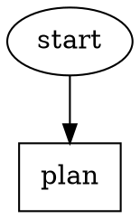

# Sprint Summary: DAG Ergonomics, Resume, Prompt Files, and Safety Timeouts

**Date:** 2026-03-08
**Tests:** 596 passing (523 attractor + 73 attractor-lsp)
**Build:** Clean
**Typecheck:** Zero errors

---

## What Was Built

Six features were implemented across the attractor pipeline engine, addressing ergonomics, safety, and developer experience:

### 1. Break on Result in `runCC` (defence-in-depth)
The `for await` loop in `cc-backend.ts` now breaks immediately after capturing the `result` message. Previously the loop would continue waiting for the SDK generator to close, which could cause indefinite blocking if the generator hung. The `finally` block still fires to clear timeouts.

### 2. Comment Test Coverage + README
Added explicit test coverage for comment syntax (line comments `//`, block comments `/* */`) in all valid positions: inline after attributes, between node declarations, spanning multiple lines. Fixed a critical bug where `//` or `/* */` inside quoted strings was incorrectly treated as comments — `stripComments()` is now string-aware. A `README.md` was added to `packages/attractor/` documenting the DAG syntax, comment support, and common patterns.

### 3. Default Graph-Wide Timeout (`default_timeout`)
Graph-level `default_timeout` attribute provides a default execution timeout for all nodes:
- Codergen nodes: `node.timeout ?? graph.attributes.defaultTimeout ?? 3_600_000` (1 hour fallback)
- Tool nodes: `node.timeout ?? graph.attributes.defaultTimeout ?? 30_000` (30s fallback)
- Node-level `timeout` always overrides the graph default
- Non-positive values produce a validation `[error]`

### 4. Prompt Files (`prompt_file`)
Nodes can now reference external prompt files instead of embedding long prompts inline:
```dot
plan [shape="box", prompt_file="prompts/sprint/plan.md"]
```
- Path is resolved relative to the `.attractor/` directory
- `prompt` takes precedence over `prompt_file` when both are set
- `$goal` variable substitution applies to file contents after reading
- Missing file at runtime → `fail` outcome with clear error (not a crash)
- Three validation rules: non-codergen misuse warning, conflict warning, file-not-found warning

### 5. Resume Last Pipeline (`--resume-last`)
New CLI flag for resuming the most recent run without manually locating the checkpoint:
```
attractor run pipeline.dot --resume-last
```
- Scans `.attractor/runs/` descending by name (ISO timestamps sort lexicographically)
- Finds first directory containing `checkpoint.json`
- If the last run completed successfully (exit node + all goal gates satisfied) → "nothing to resume" message, exit 0
- Otherwise resumes from checkpoint, writing a new log directory
- Mutually exclusive with `--resume`; errors clearly when no prior runs exist
- Respects `--cwd` flag when locating run directories

### 6. Watchdog (Idle Process Detection)
Opt-in idle detection for codergen nodes that hang without producing output:
```dot
graph [watchdog_idle = "5m", watchdog_poll = "30s"]
```
- **Opt-in**: watchdog is inactive unless `watchdog_idle` is set
- **Polling**: `setInterval` at `watchdog_poll` (default 30s) checks each active node's `lastActivity`
- **Activity tracking**: every `cc_event` and `stage_started` event updates `lastActivity`
- **Kill**: idle node's `AbortController` fires, killing the CC process; a `warning` event is emitted
- **Parallel support**: each parallel branch node gets its own `AbortController` tracked independently
- **Cleanup**: timer cleared at `pipeline_completed` and before `loop_restart`
- Three validation rules: poll-without-idle warning, idle-shorter-than-poll warning, non-positive error

---

## Key Implementation Decisions

### AbortController threading
Watchdog kill signals flow via `AbortController` → `AbortSignal` threaded through `RunConfig.abortSignal` → `CCBackendOptions.abortSignal` → chained into the internal timeout controller in `runCC`. This design means codergen only needed a one-line change to gain watchdog support.

### `validateCwd` path resolution
Validation rules that check prompt files on disk need a stable "project root" to resolve paths against. The fix walks up the file path using `lastIndexOf(".attractor")` to strip the `.attractor` component regardless of nesting depth — covering direct children, grandchildren, and deeper.

### `--resume-last` "nothing to resume" check
The check uses two conditions: the current node must be the exit node, AND all `goal_gate=true` nodes must have `status="success"` in `nodeOutcomes`. A failed pipeline that terminates at the exit node (e.g., goal gate failure) should still be resumable.

### `prompt_file` precedence and validation
The `prompt` field takes hard precedence over `prompt_file`. This is enforced both at the CodergenHandler level (check `node.prompt` first) and via a validation warning. The validation `prompt_file_not_found` rule reads the filesystem at validate-time — a missing file is a warning (not error) because the file might be generated at runtime.

---

## Files Created

| File | Purpose |
|------|---------|
| `packages/attractor/README.md` | Documents DAG syntax, comments, attributes, CLI usage |
| `packages/attractor/src/engine/watchdog.ts` | WatchdogState interface + createWatchdog/trackActivity/registerNode/unregisterNode/stopWatchdog helpers |
| `packages/attractor/test/parser/comments.test.ts` | Comment syntax test coverage |

## Files Modified

| File | Changes |
|------|---------|
| `packages/attractor/src/backend/cc-backend.ts` | Break on result; abortSignal from options chained into timeout controller |
| `packages/attractor/src/cli.ts` | `--resume-last` flag; `findLastCheckpoint()`; `default_timeout` and `validateCwd` fixes |
| `packages/attractor/src/engine/runner.ts` | Watchdog lifecycle; per-node AbortController; `trackActivity` on events; `abortSignal`/`registerWatchdogNode`/`unregisterWatchdogNode` in RunConfig |
| `packages/attractor/src/handlers/codergen.ts` | `prompt_file` reading + $goal substitution; `default_timeout` fallback; forward `config.abortSignal` |
| `packages/attractor/src/handlers/parallel.ts` | Per-branch AbortController creation and watchdog registration |
| `packages/attractor/src/handlers/tool.ts` | `default_timeout` fallback; `abortSignal` support in `runShellCommand` |
| `packages/attractor/src/model/graph.ts` | `promptFile`, `defaultTimeout`, `watchdogIdle`, `watchdogPoll` fields |
| `packages/attractor/src/parser/lexer.ts` | String-aware `stripComments()` — don't strip `//` or `/* */` inside quoted strings |
| `packages/attractor/src/parser/parser.ts` | `prompt_file`, `default_timeout`, `watchdog_idle`, `watchdog_poll` attribute parsing |
| `packages/attractor/src/validation/rules.ts` | 7 new validation rules across prompt_file, default_timeout, and watchdog sections |
| `packages/attractor/test/backend/cc-backend.test.ts` | Break-on-result test; abortSignal tests |
| `packages/attractor/test/cli/cli.test.ts` | `--resume-last`, `--cwd` integration, `validateCwd` nesting, prompt_file_not_found, logsRoot regression |
| `packages/attractor/test/engine/runner.test.ts` | Watchdog lifecycle + integration tests |
| `packages/attractor/test/handlers/codergen.test.ts` | prompt_file + abortSignal tests |
| `packages/attractor/test/handlers/tool-handler.test.ts` | default_timeout + abortSignal tests |
| `packages/attractor/test/parser/lexer.test.ts` | String-aware comment stripping edge cases |
| `packages/attractor/test/parser/parser.test.ts` | prompt_file + default_timeout + watchdog attribute parsing |
| `packages/attractor/test/validation/rules.test.ts` | 16+ new rule tests |

---

## How to Use New Features

### Comments in DAG files

Note: `//` and `/* */` inside quoted strings are preserved verbatim.

### Default timeout

```dot
digraph {
  graph [default_timeout = "30m"]
  // All codergen nodes now timeout after 30m unless they override
  long_task [shape = "box", timeout = "2h"]  // overrides to 2h
}
```


### Prompt files

```dot
digraph {
  plan [shape = "box", prompt_file = "prompts/sprint/plan.md"]
  // Resolved relative to .attractor/ directory
}
```


### Resume last run
```bash
attractor run pipeline.dot --resume-last
attractor run pipeline.dot --resume-last --cwd /path/to/project
```

### Watchdog
```dot
digraph {
  graph [watchdog_idle = "5m", watchdog_poll = "30s"]
  // Any codergen node idle >5m will be killed with a warning event
}
```

---

## Known Limitations and Future Work

1. **`wait.human` timeout**: The `ConsoleInterviewer` has no timeout mechanism; `timeout=` on wait.human nodes is silently ignored. A future PR could add a configurable auto-response timeout.

2. **Watchdog visual feedback**: The warning event is emitted but there's no visual countdown or "node X has been idle for Y minutes" periodic update. This could improve debuggability for long-running pipelines.

3. **`prompt_file` in non-codergen nodes**: Currently a validation warning. A future spec extension could allow `prompt_file` to populate context keys or be used by tool nodes as stdin.

4. **`--resume-last` across projects**: The scan always uses `.attractor/runs/` relative to `--cwd`. If a user works with multiple `.attractor/` directories in a mono-repo, they must pass `--cwd` explicitly.

5. **Watchdog and parallel fan-in**: When a watchdog kills a parallel branch, the branch is marked failed. The fan-in node aggregates this correctly, but the watchdog kill reason isn't surfaced in `parallel.results`.
