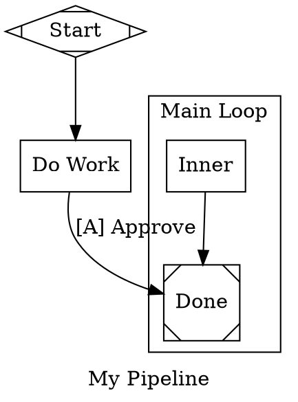

# attractor-lsp Implementation Spec

## Context

Attractor pipelines are authored in a subset of DOT syntax with domain-specific
semantics (shapes map to node types, custom attributes like `prompt`, `fidelity`,
`retry_target`, duration literals, condition expressions, model stylesheets,
etc.). The project already has a lexer, parser, and 17 validation rules that
produce diagnostics. An LSP server will surface these as real-time editor
feedback (squiggly lines, format-on-save) in Helix (primary) and optionally
VSCode.

---

## Decisions (from interview)

| Topic | Decision |
|---|---|
| Repo structure | pnpm workspace monorepo (migration done separately before this work) |
| Package name | `attractor-lsp` (`packages/attractor-lsp/`) |
| MVP scope | Diagnostics + formatting |
| Span precision | Statement-level (whole node/edge statement, not individual tokens) |
| Span type on AST | `{ line, column, endLine, endColumn }` — flat, 1-indexed in parser (converted to 0-indexed at LSP boundary) |
| Error recovery | Try-catch existing parser; single parse-error diagnostic; no partial AST |
| Transport | stdio only |
| Distribution | `node dist/server.js --stdio` (Helix/VSCode spawn it) |
| File extension | `.dag` (short, descriptive, avoids conflict with generic DOT tooling) |
| Formatter style | Strict canonical output |
| Canonical ordering | graph attrs → `node`/`edge` defaults → node declarations → edges |
| Subgraphs | Formatted recursively with same ordering rules, indented |
| Edge chains | Preserved (not expanded) |
| Value quoting | Quote everything (`shape="box"`, `weight="2"`) |
| Semicolons | None |
| Attribute ordering | Semantic grouping: identity → behavior → rest alphabetical |
| Helix config | Provide exact `languages.toml` snippet |
| Testing | Include strategy |

---

## Phase 1: Add source spans to the attractor parser

**Goal**: Every AST node, edge, and graph attribute assignment carries a source
span so the LSP can map diagnostics to editor ranges.

### 1.1 Add `Span` type

**File**: `src/model/graph.ts`

```typescript
export interface Span {
  line: number;       // 1-indexed (parser convention)
  column: number;     // 1-indexed
  endLine: number;
  endColumn: number;
}
```

### 1.2 Add optional `span` to AST interfaces

**File**: `src/model/graph.ts`

Add `span?: Span` to `GraphNode`, `Edge`, and a new `attributeSpans` map on `Graph`.

```typescript
export interface GraphNode {
  // ... existing fields unchanged ...
  span?: Span;
}

export interface Edge {
  // ... existing fields unchanged ...
  span?: Span;
}

export interface Graph {
  // ... existing fields unchanged ...
  attributeSpans?: Map<string, Span>; // key = attribute name, span = whole assignment
}
```

Using `?` (optional) means the existing attractor runtime is unaffected — it
never reads `span`. Only the LSP consumes it.

### 1.3 Record spans in the parser

**File**: `src/parser/parser.ts`

**Statement-level spans**: capture the token position at the start of each
statement and the position at the end (after consuming optional semicolons and
attribute blocks).

- **Node declarations**: span from the node ID token to the closing `]` of the
  last attribute block (or the node ID token itself if no attributes).
- **Edge chains**: span from the first node ID token to the closing `]` (or the
  last node ID if no attributes).
- **Graph attribute assignments** (`key = value`): span from the key token to
  the value token.
- **`graph [...]`/`node [...]`/`edge [...]` defaults**: span from the keyword to
  the closing `]`.
- **Subgraph**: span from `subgraph` keyword to closing `}`.

**Implementation approach**: At the start of each `parseStatement` /
`parseIdentifierStatement` / `parseSubgraph`, save `startToken = this.peek()`.
At the end, save the last consumed token's position. Build the span from
`startToken.line/column` to `lastToken.line/column + lastToken.value.length`.

Introduce a `private lastConsumed: Token` field on `Parser`, updated in
`advance()`:

```typescript
private advance(): Token {
  const t = this.tokens[this.pos++];
  this.lastConsumed = t;
  return t;
}
```

Then span construction:
```typescript
private spanFrom(startToken: Token): Span {
  const end = this.lastConsumed;
  return {
    line: startToken.line,
    column: startToken.column,
    endLine: end.line,
    endColumn: end.column + end.value.length,
  };
}
```

Apply this in:
- `parseIdentifierStatement()` — record span on each `GraphNode` and `Edge`
- `parseSubgraph()` — no direct AST entity, but nodes/edges within inherit their own spans
- `parseStatement()` for `graph [...]`, `node [...]`, `edge [...]` defaults — store on `attributeSpans`
- Top-level `key = value` assignments — store on `attributeSpans`

### 1.4 Validation rules: use spans for diagnostics

**File**: `src/validation/diagnostic.ts`

Add an optional span:

```typescript
export interface Diagnostic {
  rule: string;
  severity: Severity;
  message: string;
  nodeId?: string;
  edge?: { from: string; to: string };
  fix?: string;
  span?: Span;
}
```

**File**: `src/validation/rules.ts`

Update rules that reference specific nodes/edges to include the span from the
AST. Example for `reachabilityRule`:

```typescript
const node = graph.nodes.get(nodeId);
diags.push({
  rule: "reachability",
  severity: "error",
  message: `Node '${node.id}' is unreachable from start`,
  nodeId: node.id,
  span: node.span,
});
```

This is a mechanical change across all 17 rules: where a rule references a
`GraphNode`, include `span: node.span`; where it references an `Edge`, include
`span: edge.span`.

---

## Phase 2: LSP server package

**Directory**: `packages/attractor-lsp/`

### 2.1 Package structure

```
packages/attractor-lsp/
  package.json
  tsconfig.json
  src/
    server.ts          # LSP server entry point (stdio)
    diagnostics.ts     # Parse + validate + map to LSP diagnostics
    formatter.ts       # DOT pretty-printer
  test/
    formatter.test.ts  # Formatter snapshot tests
    diagnostics.test.ts # Diagnostic mapping tests
```

### 2.2 `package.json`

```json
{
  "name": "attractor-lsp",
  "version": "0.1.0",
  "type": "module",
  "bin": {
    "attractor-lsp": "dist/server.js"
  },
  "scripts": {
    "build": "tsc",
    "test": "vitest run"
  },
  "dependencies": {
    "attractor": "workspace:*",
    "vscode-languageserver": "^10.0.0",
    "vscode-languageserver-textdocument": "^1.0.0"
  },
  "devDependencies": {
    "typescript": "^5.7.0",
    "vitest": "^3.0.0",
    "@types/node": "^22.0.0"
  }
}
```

### 2.3 `server.ts` — LSP server entry point

Capabilities registered:
- `textDocumentSync`: full document sync (simplest; re-parse on every change)
- `documentFormattingProvider`: true

Lifecycle:
1. `initialize` — return capabilities
2. `textDocument/didOpen`, `textDocument/didChange` — call `publishDiagnostics()`
3. `textDocument/formatting` — call formatter, return `TextEdit[]`
4. `shutdown` / `exit` — clean teardown

```typescript
import {
  createConnection,
  TextDocuments,
  ProposedFeatures,
  TextDocumentSyncKind,
} from "vscode-languageserver/node.js";
import { TextDocument } from "vscode-languageserver-textdocument";
import { computeDiagnostics } from "./diagnostics.js";
import { format } from "./formatter.js";

const connection = createConnection(ProposedFeatures.all);
const documents = new TextDocuments(TextDocument);

connection.onInitialize(() => ({
  capabilities: {
    textDocumentSync: TextDocumentSyncKind.Full,
    documentFormattingProvider: true,
  },
}));

documents.onDidChangeContent((change) => {
  const diags = computeDiagnostics(change.document);
  connection.sendDiagnostics({ uri: change.document.uri, diagnostics: diags });
});

connection.onDocumentFormatting((params) => {
  const doc = documents.get(params.textDocument.uri);
  if (!doc) return [];
  return format(doc);
});

documents.listen(connection);
connection.listen();
```

The `dist/server.js` entry will have a `#!/usr/bin/env node` shebang.

### 2.4 `diagnostics.ts` — bridge attractor diagnostics to LSP

```typescript
import { parse, validate } from "attractor";
import type { Diagnostic as AttractorDiag, Graph } from "attractor";
import type { Diagnostic as LspDiag } from "vscode-languageserver/node.js";
import { DiagnosticSeverity } from "vscode-languageserver/node.js";
import type { TextDocument } from "vscode-languageserver-textdocument";

const SEVERITY_MAP = {
  error: DiagnosticSeverity.Error,
  warning: DiagnosticSeverity.Warning,
  info: DiagnosticSeverity.Information,
} as const;

export function computeDiagnostics(doc: TextDocument): LspDiag[] {
  const text = doc.getText();
  let graph;
  try {
    graph = parse(text);
  } catch (err) {
    // Extract line/column from parser error message
    return [parseErrorToDiagnostic(err, doc)];
  }

  const attractorDiags = validate(graph);
  return attractorDiags.map((d) => mapDiagnostic(d, graph, doc));
}
```

**Span mapping** (1-indexed parser → 0-indexed LSP):

```typescript
function mapDiagnostic(d: AttractorDiag, graph: Graph, doc: TextDocument): LspDiag {
  let range;
  if (d.span) {
    range = {
      start: { line: d.span.line - 1, character: d.span.column - 1 },
      end: { line: d.span.endLine - 1, character: d.span.endColumn - 1 },
    };
  } else {
    // Fallback: underline the first line of the document
    range = { start: { line: 0, character: 0 }, end: { line: 0, character: 80 } };
  }
  return {
    range,
    severity: SEVERITY_MAP[d.severity],
    source: "attractor",
    code: d.rule,
    message: d.message,
  };
}
```

**Parse error extraction**: regex the error message for `line (\d+), column (\d+)`
to build a range. If no match, fall back to line 0.

### 2.5 `formatter.ts` — strict canonical DOT formatter

**Input**: `TextDocument` (the raw `.dag` file text)
**Output**: `TextEdit[]` (a single full-document replacement)

**Strategy**: Parse the source into tokens, build a lightweight CST, reorder and
emit canonical DOT. If parsing/lexing fails, return `[]` (don't format broken files).

#### Canonical output structure



#### Formatting rules

- **Indentation**: 2 spaces per nesting level
- **Blank lines**: one blank line between each section (graph attrs, defaults, nodes, edges, subgraphs)
- **No trailing semicolons**
- **All values quoted**: `key = "value"` (even numbers: `weight = "2"`)
- **Attribute separator**: `, ` (comma-space) within `[...]` blocks
- **Edge chains preserved**: `a -> b -> c` stays as-is; attributes on the chain apply once at the end
- **Subgraphs**: recursively formatted with the same rules, indented one level

#### Semantic attribute ordering

Within `[...]` blocks, attributes are ordered:

**Identity group** (in this order):
1. `label`
2. `shape`
3. `type`
4. `class`

**Behavior group** (in this order):
5. `prompt`
6. `max_retries`
7. `goal_gate`
8. `retry_target`
9. `fallback_retry_target`
10. `fidelity`
11. `timeout`
12. `thread_id`

**Model group** (in this order):
13. `llm_model`
14. `llm_provider`
15. `reasoning_effort`

**Flags** (in this order):
16. `auto_status`
17. `allow_partial`

**Edge-specific** (in this order):
18. `condition`
19. `weight`
20. `loop_restart`

**Remaining**: any unrecognized attributes, sorted alphabetically

#### Formatter implementation

The formatter needs access to the **raw** structure of the DOT file, not just
the resolved AST. The current parser resolves defaults, expands chains, and
merges attributes — it doesn't preserve the declaration structure needed for
round-trip formatting.

**Approach**: The formatter operates at the **token level**, not the AST level.

1. Lex the source into tokens (reuse `lex()` from attractor)
2. Build a lightweight **concrete syntax tree (CST)** — a list of statements,
   each being one of:
   - `GraphAttr { key, value, span }`
   - `DefaultsStmt { target: "node"|"edge"|"graph", attrs, span }`
   - `NodeDecl { id, attrBlocks, span }`
   - `EdgeChain { ids, attrBlocks, span }`
   - `Subgraph { name?, label?, statements[], span }`
3. Sort the statements by canonical order within each scope
4. Emit formatted text

This CST parser is **separate from and simpler than the existing AST parser**.
It doesn't resolve defaults, doesn't build a Graph, doesn't merge attributes.
It just captures the structural shape of the source. ~150-200 lines.

The CST is also used by the formatter to know what `node [...]` and `edge [...]`
default statements exist (so they can be re-emitted in the correct position).

#### Edge case: defaults reordering

When the formatter moves node declarations after graph attributes, it must
ensure that `node [...]` / `edge [...]` default statements appear between graph
attributes and node declarations, matching the canonical order. If a default
statement appears after a node it applies to in the original source, the
formatter still moves it to the defaults section — this may change semantics if
defaults were intentionally late. This is acceptable for a strict canonical
formatter; the file should use the canonical ordering.

---

## Phase 3: Helix integration

### 3.1 `languages.toml` configuration

This goes in the user's Helix config (typically `~/.config/helix/languages.toml`):

```toml
[[language]]
name = "attractor"
scope = "source.attractor"
file-types = ["dag"]
comment-tokens = ["//"]
block-comment-tokens = [{ start = "/*", end = "*/" }]
indent = { tab-width = 2, unit = "  " }
language-servers = ["attractor-lsp"]
roots = ["package.json"]

# Optional: reuse DOT syntax highlighting (close enough)
# grammar = "dot"

[[language-server.attractor-lsp]]
command = "node"
args = ["/absolute/path/to/packages/attractor-lsp/dist/server.js", "--stdio"]
```

If `attractor-lsp` is globally installed or in PATH:

```toml
[[language-server.attractor-lsp]]
command = "attractor-lsp"
args = ["--stdio"]
```

### 3.2 Syntax highlighting (optional, out of MVP scope)

Helix uses tree-sitter for syntax highlighting. A `tree-sitter-attractor`
grammar could be written to get proper highlighting, but this is out of scope
for v1. The `languages.toml` config above can optionally reuse the existing
`tree-sitter-dot` grammar for approximate highlighting by uncommenting the
`grammar = "dot"` line.

---

## Phase 4: Test strategy

### 4.1 Formatter snapshot tests

**File**: `packages/attractor-lsp/test/formatter.test.ts`

Test cases (each is an input string → expected formatted output string):

1. **Minimal pipeline**: `digraph G { start [shape=Mdiamond] start -> end end [shape=Msquare] }` → canonical output
2. **Graph attributes reordering**: attributes declared between nodes are moved to top
3. **Node defaults**: `node [shape=box]` preserved in defaults section
4. **Edge defaults**: `edge [weight=1]` preserved in defaults section
5. **Attribute quoting**: bare values get quoted (`shape=box` → `shape = "box"`)
6. **Attribute ordering**: attributes reordered by semantic group
7. **Subgraph formatting**: recursive indentation and ordering
8. **Edge chains preserved**: `a -> b -> c [weight=2]` stays as chain
9. **Comments stripped**: comments are removed in formatted output (formatter works from parsed structure)
10. **Idempotency**: formatting an already-formatted file produces identical output
11. **Empty/whitespace-only file**: returns empty or unchanged
12. **Parse error**: returns no edits (don't format broken files)

### 4.2 Diagnostic mapping tests

**File**: `packages/attractor-lsp/test/diagnostics.test.ts`

Test cases:

1. **Valid file**: no diagnostics returned
2. **Parse error**: single diagnostic with correct line/column from error message
3. **Missing start node**: error diagnostic, falls back to document start (no span on graph-level diagnostic)
4. **Unreachable node**: error diagnostic with span pointing at the unreachable node declaration
5. **Invalid edge weight**: warning diagnostic with span pointing at the edge statement
6. **Multiple diagnostics**: all 17 rules fire on a maximally-broken file; verify count and severity mapping

### 4.3 Integration test

**File**: `packages/attractor-lsp/test/integration.test.ts`

Spawn the LSP server as a child process, send JSON-RPC `initialize`,
`textDocument/didOpen`, and `textDocument/formatting` requests over stdio,
verify the responses. This validates the full server lifecycle without an editor.

---

## Implementation order

1. **Phase 1**: Add `Span` to model types and parser (~150-250 lines changed in `attractor`)
2. **Phase 1b**: Thread spans into 17 validation rules (~50 lines changed)
3. **Phase 2a**: Scaffold `attractor-lsp` package (package.json, tsconfig, server.ts) (~100 lines)
4. **Phase 2b**: `diagnostics.ts` — bridge module (~80 lines)
5. **Phase 2c**: `formatter.ts` — CST parser + canonical emitter (~300-400 lines)
6. **Phase 2d**: Tests (~200-300 lines)
7. **Phase 3**: Helix config documentation

Total new/changed: ~900-1200 lines

---

## Prerequisite

The pnpm workspace monorepo migration (moving existing code into
`packages/attractor/`) must be completed before starting this work. The LSP
package at `packages/attractor-lsp/` depends on `attractor` via `workspace:*`.

---

## Out of scope (future)

- `textDocument/completion` (attribute names, node IDs)
- `textDocument/hover` (show resolved node type, inherited defaults)
- `textDocument/definition` (jump from edge target to node declaration)
- `textDocument/codeAction` (auto-fix from `diagnostic.fix` field)
- Tree-sitter grammar for syntax highlighting
- VSCode extension packaging
- TCP transport
- Partial AST / error-recovery parser
