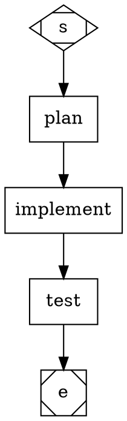

# Attractor

A TypeScript DAG pipeline execution engine that orchestrates multi-step AI coding workflows using the [Claude Code Agent SDK](https://www.npmjs.com/package/@anthropic-ai/claude-agent-sdk). Based on [StrongDM's Attractor NLSpec](https://github.com/strongdm/attractor).

Define pipelines as `.dag` graphs, and Attractor handles the rest: parsing, validation, execution, branching, retries, checkpointing, and human-in-the-loop interaction.

## Packages

This is a monorepo with three packages:

| Package | Description |
|---|---|
| [`attractor`](packages/attractor) | Core engine — DAG parser, validator, runner, CLI |
| [`attractor-lsp`](packages/attractor-lsp) | Language server — diagnostics, formatting, semantic tokens |
| [`attractor-vscode`](packages/attractor-vscode) | VS Code extension — language registration, LSP client, file icon |

## How It Works

Pipelines are directed graphs written in `.dag` files, a subset of the [DOT language](https://graphviz.org/doc/info/lang.html). Each node represents a stage — an AI coding task, a shell command, a decision point, or a prompt for human input. Edges define transitions between stages, optionally guarded by conditions.



Attractor parses this graph, validates it, and executes each node in order — sending `codergen` prompts to Claude Code, running `tool` commands in a shell, routing through `conditional` branches based on outcomes, and pausing at `wait.human` nodes for user input.

### Example: Sprint Pipeline

The [`sprint.dag`](.attractor/flows/sprint.dag) pipeline demonstrates a real-world workflow — plan, audit, implement, review, test (with 3 parallel agents), fix, and wrap up. Conditional edges create retry loops: review failures re-enter implementation, test failures route to a fix node that loops back to testing.

In its latest run (2026-03-06), the sprint pipeline:
- Executed 20 node visits across 10 distinct nodes
- Looped through implement/review twice before passing review
- Ran 3 rounds of parallel testing (3 agents each), finding and fixing 2 bugs mid-run
- Delivered a semantic token classifier and VS Code extension
- Finished with 515 tests passing at a total cost of ~$7.75 USD

## Installation

```bash
pnpm install
pnpm run build
pnpm link --global
```

This makes the `attractor` command available globally.

## Usage

### CLI

```bash
# Execute a pipeline
attractor run pipeline.dag

# Validate a .dag file without executing
attractor validate pipeline.dag

# Generate an SVG visualization (requires Graphviz)
attractor visualize pipeline.dag > pipeline.svg
```

#### Options for `run`

| Flag | Description |
|---|---|
| `--cwd <path>` | Working directory for the pipeline |
| `--logs <path>` | Custom logs directory (default: `.attractor/runs/<timestamp>`) |
| `--resume <path>` | Resume from a checkpoint file |
| `--auto-approve` | Skip human prompts (auto-select first option) |
| `--permission-mode <mode>` | CC permission mode: `default`, `acceptEdits`, `bypassPermissions` |
| `--verbose` | Show all events including edge selections and CC agent details |

### Programmatic API

```typescript
import { parse, validate, run, AutoApproveInterviewer } from "attractor";

const graph = parse(`
  digraph G {
    graph [goal="Refactor auth module"]
    s [shape=Mdiamond]
    e [shape=Msquare]
    work [shape=box, prompt="Refactor the authentication module"]
    s -> work -> e
  }
`);

const diagnostics = validate(graph);
// diagnostics: Diagnostic[] with severity "error" | "warning" | "info"

const result = await run({
  graph,
  cwd: process.cwd(),
  logsRoot: "./logs",
  interviewer: new AutoApproveInterviewer(),
  onEvent: (event) => console.error(event.kind),
});

console.log(result.status);         // "success" | "fail"
console.log(result.completedNodes); // ["work"]
console.log(result.totalCostUsd);   // 0.0342
```

## Node Types

Nodes are identified by their `shape` attribute:

| Shape | Type | Description |
|---|---|---|
| `Mdiamond` | **start** | Entry point. Every graph must have exactly one. |
| `Msquare` | **exit** | Terminal node. Every graph must have exactly one. |
| `box` | **codergen** | Sends `prompt` to Claude Code and captures the result. |
| `invhouse` | **tool** | Runs a shell command specified by `tool_command`. |
| `diamond` | **conditional** | Routes to an outgoing edge based on the previous outcome. |
| `hexagon` | **wait.human** | Presents a question to the user and routes based on their choice. |
| `component` | **parallel** | Fans out to multiple branches concurrently. |
| `tripleoctagon` | **parallel.fan_in** | Joins parallel branches and selects the best outcome. |

## Pipeline Features

### Conditional Branching

Edges can have `condition` attributes evaluated against outcomes and context:

```dot
a -> b [condition="outcome.status=success"]
a -> c [condition="outcome.status=fail"]
```

Conditions support `=`, `!=`, `>`, `>=`, `<`, `<=`, and `&&`:

```dot
a -> b [condition="outcome.status=success && context.coverage!=low"]
test -> wrapup [condition="context.clean_sessions>=3"]
test -> test   [condition="context.clean_sessions<3"]
```

### Retry Policies

Nodes can specify retry behavior on failure:

```dot
build [shape=box, prompt="Build the project", retry_max="3", retry_delay="2000"]
```

Failed nodes retry with exponential backoff and jitter, up to `retry_max` attempts.

### Goal Gates

The graph-level `goal_gate` attribute defines a condition checked at the exit node. If the gate fails, execution restarts from a specified node:

```dot
graph [goal="Ship feature", goal_gate="context.tests_pass=true", goal_gate_max="3"]
```

### Static Parallel Execution

Fan out to named branches and collect results:

```dot
test_fanout [shape=component, max_parallel="3"]
test_a      [shape=box, prompt="Test approach A"]
test_b      [shape=box, prompt="Test approach B"]
test_c      [shape=box, prompt="Test approach C"]
test_merge  [shape=tripleoctagon]

test_fanout -> test_a -> test_merge
test_fanout -> test_b -> test_merge
test_fanout -> test_c -> test_merge
```

Join policies: `wait_all` (all must succeed) or `first_success` (any success is sufficient).

### Dynamic Parallel Execution

Spawn branches at runtime from a context array using `foreach_key`:

```dot
fanout   [shape=component, foreach_key="test_files", item_key="test_file", max_parallel="4"]
run_test [shape=box, tool_command="pytest $test_file"]
merge    [shape=tripleoctagon]

fanout -> run_test -> merge
```

At runtime, `context.test_files` must contain a JSON array. The engine clones the template chain once per item, setting `context.test_file` in each branch.

### Human-in-the-Loop

Pause for human input with multiple-choice routing:

```dot
review [shape=hexagon, question="Does this look correct?"]
review -> next [label="Yes"]
review -> fix  [label="No"]
```

### Model Stylesheet

Override node attributes globally using CSS-like rules in the graph's `model_stylesheet`:

```dot
graph [model_stylesheet="* { fidelity: compact } .critical { fidelity: full }"]
deploy [shape=box, prompt="Deploy", class="critical"]
```

Selectors: `*` (universal), `.class` (class), `#id` (ID).

### Fidelity Modes

Control how much context is passed to Claude Code sessions:

- **`compact`** — Minimal context preamble (default)
- **`summary`** — Summarized prior outcomes
- **`full`** — Reuse the same CC session across nodes sharing a `thread_id`, preserving full conversation history

### Model Aliases

Use short aliases instead of full model IDs in `llm_model` attributes:

| Alias | Resolves to |
|---|---|
| `sonnet` | `claude-sonnet-4-6` |
| `opus` | `claude-opus-4-6` |
| `haiku` | `claude-haiku-4-5-20251001` |

Aliases are case-insensitive. Full model IDs and third-party model names continue to work as before.

```dot
plan [shape=box, prompt="Create a plan", llm_model="opus"]
```

Or via model stylesheet:

```dot
graph [model_stylesheet="* { llm_model: sonnet } .critical { llm_model: opus }"]
```

### Checkpoints and Resume

Execution state is saved to `checkpoint.json` after each node completes. If a run crashes, resume it:

```bash
attractor run pipeline.dag --resume .attractor/runs/2026-03-06T02-08-56-243Z/checkpoint.json
```

### Variable Expansion

Use `$goal` in prompts to substitute the graph-level `goal` attribute:

```dot
graph [goal="Add dark mode"]
plan [shape=box, prompt="Create a plan to: $goal"]
```

## Language Server (`attractor-lsp`)

The language server provides IDE support for `.dag` files:

- **Diagnostics** — real-time validation errors and warnings as you type
- **Formatting** — opinionated formatter with vertical alignment and blank-line preservation
- **Semantic tokens** — syntax coloring by role (graph keywords, node declarations, edge chains, attribute keys/values per context)

The semantic token classifier uses a lightweight state machine over the lexer output, independent of the parser. Attribute keys carry context-specific modifiers (`property.static` for graph-level, `property` for node-level, `property.abstract` for edge-level), enabling themes to distinguish them.

### Editor Support

**Helix**: No configuration needed beyond LSP registration — semantic tokens are requested automatically.

**VS Code**: Install the `attractor-vscode` extension (see below).

**Any LSP client**: The server responds to `textDocument/publishDiagnostics`, `textDocument/formatting`, and `textDocument/semanticTokens/full`.

## VS Code Extension (`attractor-vscode`)

A minimal VS Code extension that:
- Registers `.dag` as the `attractor` language
- Starts the `attractor-lsp` language server via stdio
- Provides bracket matching, auto-close, and comment toggling
- Shows a custom file icon (purple converging arrows) in the file explorer

No TextMate grammar is shipped — all syntax coloring comes from LSP semantic tokens.

```bash
cd packages/attractor-vscode && pnpm run package
code --install-extension attractor-vscode-*.vsix
```

## Project Structure

```
packages/
  attractor/            Core engine
    src/
      parser/           DOT lexer and parser
      model/            Graph, Outcome, Context, Checkpoint, Event types
      validation/       13 lint rules and diagnostic reporting
      engine/           Runner, edge selection, retry logic, transforms
      handlers/         Node type handlers (start, exit, codergen, tool, etc.)
      backend/          Claude Code Agent SDK wrapper and session management
      interviewer/      Human interaction (console, auto-approve, queue)
      stylesheet/       Model stylesheet parser and applicator
      conditions/       Condition expression parser and evaluator
      cli.ts            CLI entry point
      index.ts          Public API exports
  attractor-lsp/        Language server
    src/
      server.ts         LSP server (diagnostics, formatting, semantic tokens)
      formatter.ts      DAG formatter with alignment and blank-line preservation
      semantic-tokens.ts  Semantic token classifier (state machine over lexer)
  attractor-vscode/     VS Code extension
    src/
      extension.ts      LSP client activation
    icons/
      dag-icon.svg      File icon
```

## Development

```bash
pnpm test              # Run all tests (515: 442 attractor + 73 attractor-lsp)
pnpm run test:watch    # Watch mode
pnpm run build         # Compile TypeScript
pnpm run typecheck     # Type-check without emitting
```

## Dependencies

- **[`@anthropic-ai/claude-agent-sdk`](https://www.npmjs.com/package/@anthropic-ai/claude-agent-sdk)** — Claude Code Agent integration (sole runtime dependency for `attractor`)
- **[`vscode-languageserver`](https://www.npmjs.com/package/vscode-languageserver)** / **[`vscode-languageclient`](https://www.npmjs.com/package/vscode-languageclient)** — LSP protocol (for `attractor-lsp` and `attractor-vscode`)
- TypeScript 5.7, Vitest 3.0, Node.js (ES2022)

The DOT parser, stylesheet engine, condition evaluator, formatter, semantic token classifier, and CLI are all implemented from scratch with zero additional runtime dependencies.

## License

See [StrongDM's Attractor NLSpec](https://github.com/strongdm/attractor) for the original specification license.
