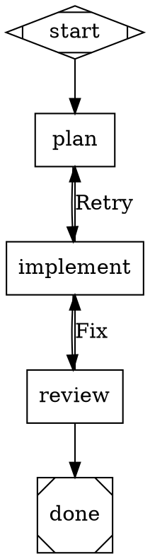

# Attractor Implementation Specification

A TypeScript implementation of [StrongDM's Attractor NLSpec](https://github.com/strongdm/attractor), using the Claude Code Agent SDK as the sole LLM backend. This document specifies every module, data structure, function signature, and behavior required for a complete implementation.

---

## Table of Contents

1. [Decisions and Scope](#1-decisions-and-scope)
2. [Project Structure](#2-project-structure)
3. [Dependencies](#3-dependencies)
4. [DOT Parser](#4-dot-parser)
5. [Graph Model](#5-graph-model)
6. [Validation and Linting](#6-validation-and-linting)
7. [Claude Code Backend](#7-claude-code-backend)
8. [Execution Engine](#8-execution-engine)
9. [Node Handlers](#9-node-handlers)
10. [State, Context, and Checkpoints](#10-state-context-and-checkpoints)
11. [Fidelity and Session Management](#11-fidelity-and-session-management)
12. [Human-in-the-Loop](#12-human-in-the-loop)
13. [Model Stylesheet](#13-model-stylesheet)
14. [Condition Expression Language](#14-condition-expression-language)
15. [CLI Interface](#15-cli-interface)
16. [Event System](#16-event-system)
17. [Definition of Done](#17-definition-of-done)

---

## 1. Decisions and Scope

### 1.1 What This Implements

This is a **full single-player** implementation of the Attractor spec:

- DOT parser for the Attractor subset
- Graph validation and linting
- Execution engine with deterministic graph traversal
- All node handlers: start, exit, codergen, conditional, wait.human, parallel, fan-in, tool
- Context, checkpoints, and crash recovery
- Human-in-the-loop via CLI stdin
- Model stylesheet parsing and application
- Condition expression evaluation
- Fidelity modes with CC session reuse
- Event system for observability

### 1.2 What This Excludes

- **HTTP server mode.** No web dashboard, no REST API, no SSE streaming. CLI only.
- **Multi-provider support.** No OpenAI, no Gemini, no unified LLM client. Claude Code is the only backend.
- **Manager loop handler** (`stack.manager_loop`). Deferred. Requires child pipeline orchestration that adds significant complexity for a feature unlikely to be needed immediately.
- **Prisma / SQLite.** Not needed. All state is filesystem-based: checkpoint.json, status.json, context snapshots. If run history tracking or querying becomes necessary, it can be added later without changing the core engine.

### 1.3 Key Design Decisions

**Claude Code Agent SDK as the LLM backend.** Every `codergen` node invokes `query()` from `@anthropic-ai/claude-agent-sdk`. No Anthropic API keys are needed. The CC SDK runs against the user's Claude subscription.

**Status file convention for outcomes.** The CC prompt instructs the agent to write `status.json` as its final action. The codergen handler reads this file for structured outcome data. If the file is absent (agent errored, timed out, or forgot), the handler falls back to the CC SDK's result message: `subtype: "success"` maps to SUCCESS, any error subtype maps to FAIL.

**Session reuse via CC's `resume` option.** Nodes with `full` fidelity and a shared `thread_id` pass the same `sessionId` to the CC SDK's `resume` option, giving the LLM full conversation history across nodes. Nodes with other fidelity modes start fresh sessions with context carried via prompt preamble.

**No streaming surface.** The CC SDK internally streams tokens, but this implementation does not expose a streaming interface to the pipeline layer. Each node invocation blocks until the CC SDK's async generator is fully consumed. Events are emitted for observability, but the caller sees a blocking `run()` call.

**Filesystem-based state.** Checkpoints, artifacts, prompts, and responses are written to a run directory tree. No database.

---

## 2. Project Structure

```
attractor/
  package.json
  tsconfig.json
  src/
    index.ts                    # Public API: run(), validate(), parse()
    cli.ts                      # CLI entry point

    parser/
      lexer.ts                  # DOT tokenizer
      parser.ts                 # DOT parser → Graph
      tokens.ts                 # Token type definitions

    model/
      graph.ts                  # Graph, Node, Edge types
      outcome.ts                # Outcome, StageStatus
      context.ts                # Context key-value store
      checkpoint.ts             # Checkpoint serialization
      events.ts                 # Event types and emitter
      fidelity.ts               # FidelityMode, thread resolution

    validation/
      rules.ts                  # Built-in lint rules
      validator.ts              # validate(), validateOrThrow()
      diagnostic.ts             # Diagnostic type

    engine/
      runner.ts                 # Core execution loop
      edge-selection.ts         # 5-step edge selection algorithm
      retry.ts                  # Retry policy and backoff
      goal-gates.ts             # Goal gate enforcement
      transforms.ts             # AST transforms (variable expansion, stylesheet)

    handlers/
      registry.ts               # Handler registry and resolution
      start.ts                  # StartHandler
      exit.ts                   # ExitHandler
      codergen.ts               # CodergenHandler (CC SDK)
      conditional.ts            # ConditionalHandler
      wait-human.ts             # WaitForHumanHandler
      parallel.ts               # ParallelHandler
      fan-in.ts                 # FanInHandler
      tool.ts                   # ToolHandler (shell commands)

    backend/
      cc-backend.ts             # Claude Code SDK wrapper
      session-manager.ts        # Session ID tracking and reuse
      preamble.ts               # Context preamble generation for non-full fidelity

    interviewer/
      interviewer.ts            # Interviewer interface
      console.ts                # ConsoleInterviewer (CLI stdin)
      auto-approve.ts           # AutoApproveInterviewer
      queue.ts                  # QueueInterviewer (testing)

    stylesheet/
      parser.ts                 # Stylesheet grammar parser
      applicator.ts             # Apply stylesheet rules to nodes

    conditions/
      parser.ts                 # Condition expression parser
      evaluator.ts              # Condition evaluation against context
```

---

## 3. Dependencies

```json
{
  "dependencies": {
    "@anthropic-ai/claude-agent-sdk": "^1.x"
  },
  "devDependencies": {
    "typescript": "^5.7",
    "vitest": "^3.x",
    "@types/node": "^22"
  }
}
```

No other runtime dependencies. The DOT parser, stylesheet parser, condition evaluator, and CLI are all implemented from scratch.

**TypeScript configuration:**

```json
{
  "compilerOptions": {
    "target": "ES2022",
    "module": "NodeNext",
    "moduleResolution": "NodeNext",
    "strict": true,
    "outDir": "dist",
    "rootDir": "src",
    "declaration": true,
    "sourceMap": true
  },
  "include": ["src"]
}
```

---

## 4. DOT Parser

### 4.1 Lexer

The lexer converts a DOT source string into a flat array of tokens. It must handle:

- Keywords: `digraph`, `graph`, `node`, `edge`, `subgraph`, `true`, `false`
- Identifiers: `[A-Za-z_][A-Za-z0-9_]*`
- Strings: double-quoted with escape sequences (`\"`, `\\`, `\n`, `\t`)
- Integers: optional sign, digits
- Floats: optional sign, digits with decimal point
- Duration literals: integer followed by `ms`, `s`, `m`, `h`, `d`
- Symbols: `{`, `}`, `[`, `]`, `=`, `,`, `;`, `->`
- Comments: `//` to end-of-line, `/* */` block comments. Strip before tokenizing.
- Whitespace: skip, but track line/column for error reporting.

```typescript
// src/parser/tokens.ts

type TokenKind =
  | "DIGRAPH" | "GRAPH" | "NODE" | "EDGE" | "SUBGRAPH"
  | "TRUE" | "FALSE"
  | "IDENTIFIER" | "STRING" | "INTEGER" | "FLOAT" | "DURATION"
  | "LBRACE" | "RBRACE" | "LBRACKET" | "RBRACKET"
  | "EQUALS" | "COMMA" | "SEMICOLON" | "ARROW"
  | "EOF";

interface Token {
  kind: TokenKind;
  value: string;
  line: number;
  column: number;
}
```

**Lexer function:**

```typescript
// src/parser/lexer.ts

function lex(source: string): Token[]
```

Strip comments first (single pass replacing comment regions with whitespace to preserve line numbers), then tokenize left-to-right. On unrecognized character, throw with line and column.

### 4.2 Parser

The parser consumes the token array and produces a `Graph` (Section 5). It implements the BNF grammar from the Attractor spec Section 2.2.

```typescript
// src/parser/parser.ts

function parse(source: string): Graph
```

**Parsing rules:**

1. Expect `DIGRAPH IDENTIFIER LBRACE`. Extract the graph name from the identifier.
2. Parse statements until `RBRACE`:
   - `graph [ ... ]` → graph attributes
   - `node [ ... ]` → node defaults (apply to all subsequent nodes in scope)
   - `edge [ ... ]` → edge defaults (apply to all subsequent edges in scope)
   - `subgraph IDENTIFIER? { ... }` → enter subgraph scope, parse inner statements, exit scope. Subgraph label derives a class name.
   - `IDENTIFIER [ ... ]` → node declaration with attributes
   - `IDENTIFIER -> IDENTIFIER (-> IDENTIFIER)* [ ... ]` → edge chain. Expand `A -> B -> C [attrs]` into edges `A->B [attrs]` and `B->C [attrs]`.
   - `IDENTIFIER = value` → top-level graph attribute (shorthand for `graph [key=value]`)
3. Attribute blocks: `[ key=value, key=value, ... ]`. Keys may be qualified (`a.b.c`). Values are typed: strings (quoted), integers, floats, booleans, durations.
4. Semicolons are optional everywhere.

**Scope handling for defaults:** Maintain a stack of `{ nodeDefaults: Map, edgeDefaults: Map }`. Push on subgraph entry, pop on exit. When creating a node, merge: subgraph defaults < node defaults < explicit attributes.

**Subgraph class derivation:** If a subgraph has a `label` attribute, derive a class name: lowercase, replace spaces with hyphens, strip non-alphanumeric characters (except hyphens). Add this class to every node inside the subgraph (append to existing `class` attribute if present).

**Error handling:** On parse error, throw an error with the rule context, expected token, actual token, and line/column.

---

## 5. Graph Model

### 5.1 Core Types

```typescript
// src/model/graph.ts

interface Graph {
  name: string;
  attributes: GraphAttributes;
  nodes: Map<string, GraphNode>;
  edges: Edge[];
}

interface GraphAttributes {
  goal: string;
  label: string;
  modelStylesheet: string;
  defaultMaxRetry: number;       // default: 50
  retryTarget: string;
  fallbackRetryTarget: string;
  defaultFidelity: string;
  raw: Map<string, string>;      // all attributes, including unrecognized ones
}

interface GraphNode {
  id: string;
  label: string;
  shape: string;                 // default: "box"
  type: string;
  prompt: string;
  maxRetries: number;            // default: 0
  goalGate: boolean;             // default: false
  retryTarget: string;
  fallbackRetryTarget: string;
  fidelity: string;
  threadId: string;
  className: string;             // comma-separated class names
  timeout: number | null;        // milliseconds, null = no timeout
  llmModel: string;
  llmProvider: string;
  reasoningEffort: string;       // default: "high"
  autoStatus: boolean;           // default: false
  allowPartial: boolean;         // default: false
  raw: Map<string, string>;      // all attributes
}

interface Edge {
  from: string;
  to: string;
  label: string;
  condition: string;
  weight: number;                // default: 0
  fidelity: string;
  threadId: string;
  loopRestart: boolean;          // default: false
}
```

### 5.2 Graph Construction

After parsing, the graph is constructed by:

1. Iterating all parsed node statements, merging defaults, and creating `GraphNode` entries.
2. Iterating all parsed edge statements, expanding chains, merging edge defaults, and creating `Edge` entries.
3. Extracting `GraphAttributes` from graph-level declarations.
4. Implicit node creation: if an edge references a node ID that has no explicit node statement, create a node with default attributes and that ID.

### 5.3 Graph Query Methods

The `Graph` object must support these queries (implement as standalone functions or as a class with methods):

```typescript
function outgoingEdges(graph: Graph, nodeId: string): Edge[]
function incomingEdges(graph: Graph, nodeId: string): Edge[]
function findStartNode(graph: Graph): GraphNode | null
function findExitNode(graph: Graph): GraphNode | null
function isTerminal(node: GraphNode): boolean
  // true when shape is "Msquare" or type is "exit"
function reachableFrom(graph: Graph, nodeId: string): Set<string>
  // BFS/DFS traversal returning all reachable node IDs
```

---

## 6. Validation and Linting

### 6.1 Diagnostic Type

```typescript
// src/validation/diagnostic.ts

type Severity = "error" | "warning" | "info";

interface Diagnostic {
  rule: string;
  severity: Severity;
  message: string;
  nodeId?: string;
  edge?: { from: string; to: string };
  fix?: string;
}
```

### 6.2 Built-In Rules

Each rule is a function `(graph: Graph) => Diagnostic[]`.

| Rule ID | Severity | Logic |
|---------|----------|-------|
| `start_node` | error | Exactly one node with `shape === "Mdiamond"`. If zero, also check for `id === "start"` or `id === "Start"`. |
| `terminal_node` | error | At least one node with `shape === "Msquare"`. If zero, also check for `id === "exit"` or `id === "end"`. |
| `start_no_incoming` | error | The start node must have zero incoming edges. |
| `exit_no_outgoing` | error | The exit node must have zero outgoing edges. |
| `reachability` | error | Every node must be in `reachableFrom(graph, startNode.id)`. Report each unreachable node. |
| `edge_target_exists` | error | Every `edge.from` and `edge.to` must exist in `graph.nodes`. |
| `condition_syntax` | error | Every edge with a non-empty `condition` must parse without error (Section 14). |
| `stylesheet_syntax` | error | If `graph.attributes.modelStylesheet` is non-empty, it must parse without error (Section 13). |
| `type_known` | warning | If a node has a non-empty `type`, it should be one of: `start`, `exit`, `codergen`, `conditional`, `wait.human`, `parallel`, `parallel.fan_in`, `tool`. |
| `fidelity_valid` | warning | If a node has a non-empty `fidelity`, it must be one of: `full`, `truncate`, `compact`, `summary:low`, `summary:medium`, `summary:high`. |
| `retry_target_exists` | warning | If a node has `retryTarget` or `fallbackRetryTarget`, those IDs must exist in `graph.nodes`. |
| `goal_gate_has_retry` | warning | Nodes with `goalGate === true` should have a `retryTarget` or `fallbackRetryTarget` (or the graph should have one). |
| `prompt_on_llm_nodes` | warning | Nodes that resolve to the codergen handler (shape `box` or default) should have a non-empty `prompt` or `label`. |

### 6.3 Validation API

```typescript
// src/validation/validator.ts

function validate(graph: Graph, extraRules?: LintRule[]): Diagnostic[]

function validateOrThrow(graph: Graph, extraRules?: LintRule[]): Diagnostic[]
  // Throws if any diagnostic has severity "error".
  // Returns warnings and info diagnostics.

type LintRule = (graph: Graph) => Diagnostic[];
```

---

## 7. Claude Code Backend

### 7.1 CC Backend Interface

```typescript
// src/backend/cc-backend.ts

import { query, type SDKMessage, type SDKResultMessage } from "@anthropic-ai/claude-agent-sdk";

interface CCBackendOptions {
  cwd: string;
  model?: string;
  reasoningEffort?: "low" | "medium" | "high";
  maxTurns?: number;
  sessionId?: string;          // for fresh sessions
  resume?: string;             // for session continuity
  systemPromptAppend?: string; // additional system prompt instructions
  timeout?: number;            // abort after this many ms
  permissionMode?: "default" | "acceptEdits" | "bypassPermissions";
}

interface CCResult {
  text: string;                // final result text from SDKResultMessage
  sessionId: string;           // captured from SDKSystemMessage init
  success: boolean;            // true if subtype === "success"
  costUsd: number;
  numTurns: number;
  durationMs: number;
  errorSubtype?: string;       // present on failure: "error_max_turns", "error_during_execution", etc.
  errors?: string[];           // error messages on failure
}
```

### 7.2 CC Backend Execution

```typescript
async function runCC(
  prompt: string,
  options: CCBackendOptions,
  onEvent?: (event: SDKMessage) => void
): Promise<CCResult>
```

**Implementation:**

1. Construct the `query()` options object:
   ```typescript
   const abortController = new AbortController();
   let timeoutHandle: NodeJS.Timeout | undefined;
   if (options.timeout) {
     timeoutHandle = setTimeout(() => abortController.abort(), options.timeout);
   }

   const q = query({
     prompt,
     options: {
       cwd: options.cwd,
       model: options.model ?? "claude-sonnet-4-5-20250514",
       effort: options.reasoningEffort ?? "high",
       maxTurns: options.maxTurns ?? 200,
       abortController,
       resume: options.resume,
       sessionId: options.sessionId,
       permissionMode: options.permissionMode ?? "bypassPermissions",
       allowDangerouslySkipPermissions: options.permissionMode === "bypassPermissions",
       systemPrompt: options.systemPromptAppend
         ? { type: "preset", preset: "claude_code", append: options.systemPromptAppend }
         : undefined,
     },
   });
   ```
2. Consume the async generator to completion, capturing:
   - The `session_id` from the first `SDKSystemMessage` (type `"system"`, subtype `"init"`).
   - Every `SDKAssistantMessage` for event forwarding.
   - The final `SDKResultMessage` for the return value.
3. On each message, if `onEvent` is provided, call it.
4. Clear the timeout handle on completion.
5. Construct and return `CCResult` from the `SDKResultMessage` fields.

### 7.3 Session Manager

Tracks `sessionId` values keyed by `threadId`, enabling session reuse for `full` fidelity nodes.

```typescript
// src/backend/session-manager.ts

class SessionManager {
  private sessions: Map<string, string> = new Map();
  // key: threadId, value: CC sessionId

  getSessionId(threadId: string): string | undefined {
    return this.sessions.get(threadId);
  }

  setSessionId(threadId: string, sessionId: string): void {
    this.sessions.set(threadId, sessionId);
  }

  clear(): void {
    this.sessions.clear();
  }
}
```

### 7.4 Preamble Generator

For non-`full` fidelity modes, generates a context preamble string prepended to the node's prompt.

```typescript
// src/backend/preamble.ts

function generatePreamble(
  mode: FidelityMode,
  context: Context,
  graph: Graph,
  completedNodes: string[],
  nodeOutcomes: Map<string, Outcome>
): string
```

**Behavior by mode:**

| Mode | Preamble Content |
|------|-----------------|
| `truncate` | Graph goal and run ID only. 2-3 lines. |
| `compact` | Structured bullets: goal, completed stages with outcomes, current context keys with values. |
| `summary:low` | Brief sentence: goal, how many stages completed, last outcome. ~150 words. |
| `summary:medium` | Moderate detail: recent 3 stage outcomes, active context values, notable events. ~400 words. |
| `summary:high` | Detailed: all stage outcomes, all context values, full event summary. ~750 words. |
| `full` | Not used by preamble generator. Session reuse provides full history. |

The preamble is formatted as a markdown block:

```
## Pipeline Context

**Goal:** {graph.goal}
**Progress:** {completed_count}/{total_count} stages complete

### Completed Stages
- {node_id}: {outcome.status} — {outcome.notes}
...

### Current Context
- {key}: {value}
...
```

---

## 8. Execution Engine

### 8.1 Run Configuration

```typescript
// src/engine/runner.ts

interface RunConfig {
  graph: Graph;
  cwd: string;
  logsRoot: string;               // directory for run artifacts
  interviewer: Interviewer;       // human-in-the-loop interface
  onEvent?: (event: PipelineEvent) => void;
  resumeFromCheckpoint?: string;  // path to checkpoint.json
  ccPermissionMode?: "default" | "acceptEdits" | "bypassPermissions";
}

interface RunResult {
  status: "success" | "fail";
  completedNodes: string[];
  nodeOutcomes: Map<string, Outcome>;
  finalContext: Map<string, unknown>;
  durationMs: number;
}
```

### 8.2 Core Execution Loop

```typescript
async function run(config: RunConfig): Promise<RunResult>
```

**Implementation — this is the heart of the system:**

```
1. INITIALIZE
   - Create logsRoot directory if it does not exist.
   - Create Context. Mirror graph attributes into context:
     context.set("graph.goal", graph.attributes.goal)
   - Create SessionManager.
   - Create HandlerRegistry, register all built-in handlers.
   - Apply transforms: variable expansion, stylesheet application.
   - Run validateOrThrow(graph). Abort on errors.
   - If resumeFromCheckpoint is set, load checkpoint and restore state
     (see Section 10.3).
   - Initialize tracking: completedNodes = [], nodeOutcomes = Map,
     startTime = Date.now().

2. RESOLVE START NODE
   - currentNode = findStartNode(graph).
   - If null, throw "No start node found".

3. TRAVERSAL LOOP
   WHILE true:
     a. CHECK TERMINAL
        If isTerminal(currentNode):
          - Run goal gate check (Section 8.4).
          - If unsatisfied, find retry target and set currentNode to it.
            CONTINUE.
          - If satisfied or no goal gates, BREAK.

     b. EXECUTE NODE
        - handler = registry.resolve(currentNode)
        - retryPolicy = buildRetryPolicy(currentNode, graph)
        - outcome = await executeWithRetry(handler, currentNode,
            context, graph, config, retryPolicy)

     c. RECORD
        - completedNodes.push(currentNode.id)
        - nodeOutcomes.set(currentNode.id, outcome)

     d. APPLY CONTEXT UPDATES
        - For each (key, value) in outcome.contextUpdates:
            context.set(key, value)
        - context.set("outcome", outcome.status)
        - If outcome.preferredLabel is non-empty:
            context.set("preferred_label", outcome.preferredLabel)

     e. CHECKPOINT
        - Save checkpoint to {logsRoot}/checkpoint.json

     f. SELECT NEXT EDGE
        - edge = selectEdge(graph, currentNode, outcome, context)
        - If edge is null:
            If outcome.status === "fail":
              BREAK with fail result.
            BREAK with success result.

     g. LOOP RESTART
        - If edge.loopRestart:
            Restart the run with a fresh logsRoot.
            RETURN.

     h. ADVANCE
        - currentNode = graph.nodes.get(edge.to)!
        - Emit StageTransition event.

4. FINALIZE
   - Write final checkpoint.
   - Emit PipelineCompleted or PipelineFailed event.
   - Return RunResult.
```

### 8.3 Edge Selection

```typescript
// src/engine/edge-selection.ts

function selectEdge(
  graph: Graph,
  node: GraphNode,
  outcome: Outcome,
  context: Context
): Edge | null
```

**Algorithm (5-step priority):**

```
1. CONDITION MATCHING
   - Collect edges where condition is non-empty AND evaluateCondition(edge.condition, outcome, context) === true.
   - If any found, return the one with highest weight (ties broken by lexical order of edge.to).

2. PREFERRED LABEL
   - If outcome.preferredLabel is non-empty:
     - For each outgoing edge, normalize labels (lowercase, trim, strip accelerator prefixes like "[Y] ", "Y) ", "Y - ").
     - If a match is found, return that edge.

3. SUGGESTED NEXT IDS
   - If outcome.suggestedNextIds is non-empty:
     - For each suggested ID, find an outgoing edge whose .to matches.
     - Return the first match.

4. HIGHEST WEIGHT (unconditional edges only)
   - Filter to edges with empty condition.
   - Return the one with highest weight.

5. LEXICAL TIEBREAK
   - Among edges tied on weight, return the one whose .to comes first alphabetically.
```

If no outgoing edges exist at all, return null.

### 8.4 Goal Gate Enforcement

```typescript
// src/engine/goal-gates.ts

interface GoalGateResult {
  satisfied: boolean;
  failedNode?: GraphNode;
}

function checkGoalGates(
  graph: Graph,
  nodeOutcomes: Map<string, Outcome>
): GoalGateResult
```

Iterate all nodes in `nodeOutcomes`. For each node with `goalGate === true`, check that its outcome status is `"success"` or `"partial_success"`. If any is not, return `{ satisfied: false, failedNode }`.

When unsatisfied, the engine resolves a retry target in this order:
1. `failedNode.retryTarget`
2. `failedNode.fallbackRetryTarget`
3. `graph.attributes.retryTarget`
4. `graph.attributes.fallbackRetryTarget`

If no target is found at any level, the pipeline fails.

### 8.5 Retry Logic

```typescript
// src/engine/retry.ts

interface RetryPolicy {
  maxAttempts: number;
  initialDelayMs: number;
  backoffFactor: number;
  maxDelayMs: number;
  jitter: boolean;
}

function buildRetryPolicy(node: GraphNode, graph: Graph): RetryPolicy {
  const maxRetries = node.maxRetries > 0
    ? node.maxRetries
    : graph.attributes.defaultMaxRetry;
  return {
    maxAttempts: maxRetries + 1,
    initialDelayMs: 200,
    backoffFactor: 2.0,
    maxDelayMs: 60_000,
    jitter: true,
  };
}

function delayForAttempt(attempt: number, policy: RetryPolicy): number {
  // attempt is 1-indexed (first retry = attempt 1)
  let delay = policy.initialDelayMs * (policy.backoffFactor ** (attempt - 1));
  delay = Math.min(delay, policy.maxDelayMs);
  if (policy.jitter) {
    delay *= 0.5 + Math.random();
  }
  return delay;
}
```

**`executeWithRetry`:**

```typescript
async function executeWithRetry(
  handler: Handler,
  node: GraphNode,
  context: Context,
  graph: Graph,
  config: RunConfig,
  policy: RetryPolicy
): Promise<Outcome>
```

```
FOR attempt FROM 1 TO policy.maxAttempts:
  TRY:
    outcome = await handler.execute(node, context, graph, config)
  CATCH error:
    IF attempt < policy.maxAttempts:
      delay = delayForAttempt(attempt, policy)
      await sleep(delay)
      CONTINUE
    RETURN Outcome { status: "fail", failureReason: error.message }

  IF outcome.status is "success" or "partial_success":
    RETURN outcome

  IF outcome.status is "retry":
    IF attempt < policy.maxAttempts:
      delay = delayForAttempt(attempt, policy)
      await sleep(delay)
      CONTINUE
    ELSE:
      IF node.allowPartial:
        RETURN Outcome { status: "partial_success", notes: "retries exhausted" }
      RETURN Outcome { status: "fail", failureReason: "max retries exceeded" }

  IF outcome.status is "fail":
    RETURN outcome

RETURN Outcome { status: "fail", failureReason: "max retries exceeded" }
```

---

## 9. Node Handlers

### 9.1 Handler Interface

```typescript
// src/handlers/registry.ts

interface Handler {
  execute(
    node: GraphNode,
    context: Context,
    graph: Graph,
    config: RunConfig
  ): Promise<Outcome>;
}
```

### 9.2 Handler Registry

```typescript
class HandlerRegistry {
  private handlers = new Map<string, Handler>();
  private defaultHandler: Handler;

  constructor(defaultHandler: Handler) {
    this.defaultHandler = defaultHandler;
  }

  register(typeString: string, handler: Handler): void {
    this.handlers.set(typeString, handler);
  }

  resolve(node: GraphNode): Handler {
    // 1. Explicit type attribute
    if (node.type && this.handlers.has(node.type)) {
      return this.handlers.get(node.type)!;
    }
    // 2. Shape-based resolution
    const handlerType = SHAPE_TO_TYPE[node.shape];
    if (handlerType && this.handlers.has(handlerType)) {
      return this.handlers.get(handlerType)!;
    }
    // 3. Default
    return this.defaultHandler;
  }
}

const SHAPE_TO_TYPE: Record<string, string> = {
  Mdiamond: "start",
  Msquare: "exit",
  box: "codergen",
  hexagon: "wait.human",
  diamond: "conditional",
  component: "parallel",
  tripleoctagon: "parallel.fan_in",
  parallelogram: "tool",
  house: "stack.manager_loop",  // recognized but handler is deferred (Section 1.2)
};
```

### 9.3 Start Handler

```typescript
// src/handlers/start.ts

class StartHandler implements Handler {
  async execute(): Promise<Outcome> {
    return { status: "success" };
  }
}
```

### 9.4 Exit Handler

```typescript
// src/handlers/exit.ts

class ExitHandler implements Handler {
  async execute(): Promise<Outcome> {
    return { status: "success" };
  }
}
```

### 9.5 Codergen Handler

This is the most complex handler. It orchestrates a Claude Code session for the node.

```typescript
// src/handlers/codergen.ts

class CodergenHandler implements Handler {
  constructor(
    private sessionManager: SessionManager,
  ) {}

  async execute(
    node: GraphNode,
    context: Context,
    graph: Graph,
    config: RunConfig
  ): Promise<Outcome> {
    // 1. BUILD PROMPT
    let prompt = node.prompt || node.label;
    prompt = expandVariables(prompt, graph, context);

    // 2. RESOLVE FIDELITY AND SESSION
    const fidelity = resolveFidelity(node, graph);
    const threadId = resolveThreadId(node, graph);
    let ccOptions: CCBackendOptions;

    if (fidelity === "full" && threadId) {
      const existingSessionId = this.sessionManager.getSessionId(threadId);
      if (existingSessionId) {
        // Resume existing session
        ccOptions = {
          cwd: config.cwd,
          resume: existingSessionId,
          model: node.llmModel || undefined,
          reasoningEffort: parseEffort(node.reasoningEffort),
          timeout: node.timeout ?? undefined,
          permissionMode: config.ccPermissionMode,
        };
      } else {
        // Fresh session, will track its ID
        ccOptions = {
          cwd: config.cwd,
          model: node.llmModel || undefined,
          reasoningEffort: parseEffort(node.reasoningEffort),
          timeout: node.timeout ?? undefined,
          permissionMode: config.ccPermissionMode,
        };
      }
    } else {
      // Non-full fidelity: generate preamble, fresh session
      const preamble = generatePreamble(
        fidelity, context, graph,
        /* completedNodes and nodeOutcomes from engine — passed via config or context */
      );
      prompt = preamble + "\n\n---\n\n" + prompt;
      ccOptions = {
        cwd: config.cwd,
        model: node.llmModel || undefined,
        reasoningEffort: parseEffort(node.reasoningEffort),
        timeout: node.timeout ?? undefined,
        permissionMode: config.ccPermissionMode,
      };
    }

    // 3. APPEND STATUS FILE INSTRUCTION
    const stageDir = path.join(config.logsRoot, node.id);
    await fs.mkdir(stageDir, { recursive: true });
    const statusFilePath = path.join(stageDir, "status.json");

    const statusInstruction = buildStatusInstruction(statusFilePath, node, graph);
    ccOptions.systemPromptAppend = statusInstruction;

    // 4. WRITE PROMPT TO LOGS
    await fs.writeFile(path.join(stageDir, "prompt.md"), prompt);

    // 5. CALL CC
    const ccResult = await runCC(prompt, ccOptions, (event) => {
      config.onEvent?.({
        kind: "cc_event",
        nodeId: node.id,
        event,
        timestamp: Date.now(),
      });
    });

    // 6. TRACK SESSION
    if (fidelity === "full" && threadId) {
      this.sessionManager.setSessionId(threadId, ccResult.sessionId);
    }

    // 7. WRITE RESPONSE TO LOGS
    await fs.writeFile(path.join(stageDir, "response.md"), ccResult.text);

    // 8. READ STATUS FILE OR FALL BACK
    let outcome: Outcome;
    try {
      const statusRaw = await fs.readFile(statusFilePath, "utf-8");
      const statusData = JSON.parse(statusRaw);
      outcome = parseStatusFile(statusData, node.id);
    } catch {
      // Fallback: derive outcome from CC result
      if (ccResult.success) {
        outcome = {
          status: "success",
          notes: `Stage completed: ${node.id}`,
          contextUpdates: {
            last_stage: node.id,
            last_response: ccResult.text.slice(0, 200),
          },
        };
      } else {
        outcome = {
          status: "fail",
          failureReason: ccResult.errors?.join("; ") ?? ccResult.errorSubtype ?? "CC execution failed",
        };
      }
    }

    // 9. AUTO STATUS
    if (node.autoStatus && outcome.status === undefined) {
      outcome = { status: "success", notes: "auto-status: handler completed without writing status" };
    }

    // 10. WRITE FINAL STATUS
    await fs.writeFile(statusFilePath, JSON.stringify(outcome, null, 2));

    return outcome;
  }
}
```

**Status file instruction:**

```typescript
function buildStatusInstruction(
  statusFilePath: string,
  node: GraphNode,
  graph: Graph
): string {
  const edgeLabels = outgoingEdges(graph, node.id)
    .map(e => e.label)
    .filter(Boolean);

  return `
IMPORTANT — PIPELINE INTEGRATION:
You are operating as a stage in an automated pipeline. When you have
finished your work for this stage, you MUST write a status file to
communicate your result to the pipeline engine.

Write the following JSON file as your FINAL action:
  Path: ${statusFilePath}

Schema:
{
  "outcome": "success" | "retry" | "fail",
  "preferred_next_label": "<optional: edge label to follow next>",
  "suggested_next_ids": [],
  "context_updates": { "<key>": "<value>" },
  "notes": "<brief summary of what you did>"
}

Rules:
- "outcome" is REQUIRED. Use "success" if you completed the task, "retry"
  if you made progress but need another attempt, "fail" if the task cannot
  be completed.
- "context_updates" is optional. Use it to pass data to subsequent stages.
  Keys should be descriptive (e.g., "files_changed", "test_results").
- "notes" is optional but recommended. Keep it under 200 characters.
${edgeLabels.length > 0 ? `- "preferred_next_label" can be one of: ${edgeLabels.map(l => `"${l}"`).join(", ")}` : ""}

Do NOT skip writing this file. The pipeline cannot proceed without it.
`.trim();
}
```

**Status file parsing:**

```typescript
function parseStatusFile(data: unknown, nodeId: string): Outcome {
  // Validate shape, coerce types, provide defaults
  const obj = data as Record<string, unknown>;
  return {
    status: parseStageStatus(obj.outcome as string) ?? "success",
    preferredLabel: (obj.preferred_next_label as string) ?? "",
    suggestedNextIds: (obj.suggested_next_ids as string[]) ?? [],
    contextUpdates: (obj.context_updates as Record<string, unknown>) ?? {},
    notes: (obj.notes as string) ?? "",
    failureReason: obj.outcome === "fail"
      ? (obj.notes as string) ?? "Stage reported failure"
      : undefined,
  };
}
```

### 9.6 Conditional Handler

```typescript
// src/handlers/conditional.ts

class ConditionalHandler implements Handler {
  async execute(node: GraphNode): Promise<Outcome> {
    return {
      status: "success",
      notes: `Conditional node evaluated: ${node.id}`,
    };
  }
}
```

Routing is handled by the engine's edge selection, not this handler.

### 9.7 Wait For Human Handler

```typescript
// src/handlers/wait-human.ts

class WaitForHumanHandler implements Handler {
  constructor(private interviewer: Interviewer) {}

  async execute(
    node: GraphNode,
    context: Context,
    graph: Graph,
    config: RunConfig
  ): Promise<Outcome> {
    // 1. Derive choices from outgoing edges
    const edges = outgoingEdges(graph, node.id);
    if (edges.length === 0) {
      return { status: "fail", failureReason: "No outgoing edges for human gate" };
    }

    const choices = edges.map(edge => ({
      key: parseAcceleratorKey(edge.label || edge.to),
      label: edge.label || edge.to,
      to: edge.to,
    }));

    // 2. Present to interviewer
    const question: Question = {
      text: node.label || "Select an option:",
      type: "multiple_choice",
      options: choices.map(c => ({ key: c.key, label: c.label })),
      stage: node.id,
    };

    const answer = await this.interviewer.ask(question);

    // 3. Handle timeout/skip
    if (answer.value === "TIMEOUT" || answer.value === "SKIPPED") {
      const defaultChoice = node.raw.get("human.default_choice");
      if (defaultChoice) {
        const defaultEdge = choices.find(c => c.to === defaultChoice || c.key === defaultChoice);
        if (defaultEdge) {
          return {
            status: "success",
            suggestedNextIds: [defaultEdge.to],
            contextUpdates: {
              "human.gate.selected": defaultEdge.key,
              "human.gate.label": defaultEdge.label,
            },
          };
        }
      }
      return { status: "retry", failureReason: "Human gate timeout, no default" };
    }

    // 4. Find matching choice
    const selected = choices.find(c =>
      c.key.toLowerCase() === answer.value.toLowerCase() ||
      c.label.toLowerCase() === answer.value.toLowerCase()
    ) ?? choices[0];

    return {
      status: "success",
      suggestedNextIds: [selected.to],
      contextUpdates: {
        "human.gate.selected": selected.key,
        "human.gate.label": selected.label,
      },
    };
  }
}
```

**Accelerator key parsing:**

```typescript
function parseAcceleratorKey(label: string): string {
  // [K] Label → K
  const bracketMatch = label.match(/^\[(\w)\]\s+/);
  if (bracketMatch) return bracketMatch[1];

  // K) Label → K
  const parenMatch = label.match(/^(\w)\)\s+/);
  if (parenMatch) return parenMatch[1];

  // K - Label → K
  const dashMatch = label.match(/^(\w)\s+-\s+/);
  if (dashMatch) return dashMatch[1];

  // First character
  return label.charAt(0).toUpperCase();
}
```

### 9.8 Parallel Handler

```typescript
// src/handlers/parallel.ts

class ParallelHandler implements Handler {
  async execute(
    node: GraphNode,
    context: Context,
    graph: Graph,
    config: RunConfig
  ): Promise<Outcome> {
    const branches = outgoingEdges(graph, node.id);
    if (branches.length === 0) {
      return { status: "fail", failureReason: "No branches for parallel node" };
    }

    const joinPolicy = node.raw.get("join_policy") ?? "wait_all";
    const maxParallel = parseInt(node.raw.get("max_parallel") ?? "4", 10);

    // Execute branches with bounded concurrency
    const results: Outcome[] = [];
    const pending = [...branches];
    const active: Promise<Outcome>[] = [];

    while (pending.length > 0 || active.length > 0) {
      while (active.length < maxParallel && pending.length > 0) {
        const branch = pending.shift()!;
        const branchContext = context.clone();
        const promise = executeBranch(
          branch.to, branchContext, graph, config
        );
        active.push(promise);
      }

      if (active.length > 0) {
        const result = await Promise.race(
          active.map((p, i) => p.then(r => ({ result: r, index: i })))
        );
        results.push(result.result);
        active.splice(result.index, 1);
      }
    }

    // Evaluate join policy
    const successCount = results.filter(r =>
      r.status === "success" || r.status === "partial_success"
    ).length;
    const failCount = results.filter(r => r.status === "fail").length;

    context.set("parallel.results", JSON.stringify(results));

    if (joinPolicy === "wait_all") {
      return {
        status: failCount === 0 ? "success" : "partial_success",
        contextUpdates: {
          "parallel.success_count": String(successCount),
          "parallel.fail_count": String(failCount),
        },
      };
    }

    if (joinPolicy === "first_success") {
      return {
        status: successCount > 0 ? "success" : "fail",
      };
    }

    return { status: "success" };
  }
}
```

**`executeBranch`** walks the graph from the given node ID until it hits a node with no outgoing edges or a fan-in node, using the same handler dispatch and edge selection as the main loop but with an isolated context clone. This is a recursive call into a simplified version of the traversal loop that terminates at dead ends or `parallel.fan_in` nodes.

### 9.9 Fan-In Handler

```typescript
// src/handlers/fan-in.ts

class FanInHandler implements Handler {
  async execute(
    node: GraphNode,
    context: Context
  ): Promise<Outcome> {
    const resultsRaw = context.get("parallel.results");
    if (!resultsRaw) {
      return { status: "fail", failureReason: "No parallel results to evaluate" };
    }

    const results: Outcome[] = JSON.parse(resultsRaw as string);
    // Heuristic selection: best by status, then by notes length as a proxy
    const ranked = [...results].sort((a, b) => {
      const statusRank = { success: 0, partial_success: 1, retry: 2, fail: 3 };
      return (statusRank[a.status] ?? 3) - (statusRank[b.status] ?? 3);
    });

    const best = ranked[0];
    if (!best) {
      return { status: "fail", failureReason: "No candidates" };
    }

    return {
      status: "success",
      contextUpdates: {
        "parallel.fan_in.best_outcome": best.status,
        "parallel.fan_in.best_notes": best.notes ?? "",
      },
    };
  }
}
```

### 9.10 Tool Handler

```typescript
// src/handlers/tool.ts

import { execFile } from "node:child_process";

class ToolHandler implements Handler {
  async execute(
    node: GraphNode,
    context: Context,
    graph: Graph,
    config: RunConfig
  ): Promise<Outcome> {
    const command = node.raw.get("tool_command");
    if (!command) {
      return { status: "fail", failureReason: "No tool_command specified" };
    }

    const timeoutMs = node.timeout ?? 30_000;

    try {
      const result = await runShellCommand(command, {
        cwd: config.cwd,
        timeoutMs,
      });

      return {
        status: result.exitCode === 0 ? "success" : "fail",
        contextUpdates: {
          "tool.output": result.stdout.slice(0, 5000),
          "tool.exit_code": String(result.exitCode),
        },
        notes: `Tool completed: ${command} (exit ${result.exitCode})`,
        failureReason: result.exitCode !== 0
          ? `Command exited with code ${result.exitCode}: ${result.stderr.slice(0, 500)}`
          : undefined,
      };
    } catch (error) {
      return {
        status: "fail",
        failureReason: `Tool execution error: ${(error as Error).message}`,
      };
    }
  }
}
```

**`runShellCommand`:**

```typescript
interface ShellResult {
  stdout: string;
  stderr: string;
  exitCode: number;
  timedOut: boolean;
}

async function runShellCommand(
  command: string,
  options: { cwd: string; timeoutMs: number }
): Promise<ShellResult>
```

Spawn via `child_process.exec` with `shell: true`, capture stdout/stderr, enforce timeout with SIGTERM then SIGKILL after 2 seconds.

---

## 10. State, Context, and Checkpoints

### 10.1 Context

```typescript
// src/model/context.ts

class Context {
  private values = new Map<string, unknown>();

  set(key: string, value: unknown): void {
    this.values.set(key, value);
  }

  get(key: string): unknown | undefined {
    return this.values.get(key);
  }

  getString(key: string, defaultValue = ""): string {
    const v = this.values.get(key);
    return v != null ? String(v) : defaultValue;
  }

  snapshot(): Record<string, unknown> {
    return Object.fromEntries(this.values);
  }

  clone(): Context {
    const c = new Context();
    for (const [k, v] of this.values) {
      c.values.set(k, v);
    }
    return c;
  }

  applyUpdates(updates: Record<string, unknown>): void {
    for (const [k, v] of Object.entries(updates)) {
      this.values.set(k, v);
    }
  }
}
```

No locking required. The execution engine is single-threaded for the top-level graph. Parallel handlers receive clones.

### 10.2 Outcome

```typescript
// src/model/outcome.ts

type StageStatus = "success" | "partial_success" | "retry" | "fail" | "skipped";

interface Outcome {
  status: StageStatus;
  preferredLabel?: string;
  suggestedNextIds?: string[];
  contextUpdates?: Record<string, unknown>;
  notes?: string;
  failureReason?: string;
}
```

### 10.3 Checkpoint

```typescript
// src/model/checkpoint.ts

interface Checkpoint {
  timestamp: number;
  currentNode: string;
  completedNodes: string[];
  nodeRetries: Record<string, number>;
  contextValues: Record<string, unknown>;
  sessionMap: Record<string, string>;  // threadId → CC sessionId
}

async function saveCheckpoint(
  checkpoint: Checkpoint,
  logsRoot: string
): Promise<void> {
  const filePath = path.join(logsRoot, "checkpoint.json");
  await fs.writeFile(filePath, JSON.stringify(checkpoint, null, 2));
}

async function loadCheckpoint(
  filePath: string
): Promise<Checkpoint> {
  const raw = await fs.readFile(filePath, "utf-8");
  return JSON.parse(raw);
}
```

**Resume behavior:**

1. Load checkpoint from `{logsRoot}/checkpoint.json`.
2. Restore context from `checkpoint.contextValues`.
3. Restore `completedNodes` and `nodeRetries`.
4. Restore session manager from `checkpoint.sessionMap`.
5. Determine the next node: find the outgoing edge from `checkpoint.currentNode` using the last recorded outcome, then set `currentNode` to the edge's target.
6. For the first node after resume, if it was using `full` fidelity, degrade to `summary:high` because in-memory CC sessions cannot be serialized (only the `sessionId` is saved; CC SDK handles actual session persistence on disk).

---

## 11. Fidelity and Session Management

### 11.1 Fidelity Modes

```typescript
// src/model/fidelity.ts

type FidelityMode =
  | "full"
  | "truncate"
  | "compact"
  | "summary:low"
  | "summary:medium"
  | "summary:high";
```

### 11.2 Fidelity Resolution

```typescript
function resolveFidelity(
  node: GraphNode,
  graph: Graph,
  incomingEdge?: Edge
): FidelityMode {
  // Precedence: incoming edge > node > graph default > "compact"
  if (incomingEdge?.fidelity) return incomingEdge.fidelity as FidelityMode;
  if (node.fidelity) return node.fidelity as FidelityMode;
  if (graph.attributes.defaultFidelity) return graph.attributes.defaultFidelity as FidelityMode;
  return "compact";
}
```

### 11.3 Thread Resolution

```typescript
function resolveThreadId(
  node: GraphNode,
  graph: Graph,
  incomingEdge?: Edge,
  previousNodeId?: string
): string {
  // Precedence: node > edge > class-derived > previous node ID
  if (node.threadId) return node.threadId;
  if (incomingEdge?.threadId) return incomingEdge.threadId;
  if (node.className) return node.className.split(",")[0].trim();
  return previousNodeId ?? node.id;
}
```

### 11.4 Session Lifecycle

When a codergen node executes with `full` fidelity:

1. Resolve the `threadId`.
2. Check `sessionManager.getSessionId(threadId)`.
3. If found: pass the session ID as `resume` to the CC SDK. The CC SDK loads the full conversation history from its own session store and continues the conversation. The node's prompt is submitted as a new user message in the existing session.
4. If not found: create a fresh session. After CC returns, capture the `sessionId` from the `SDKSystemMessage` and store it via `sessionManager.setSessionId(threadId, sessionId)`.

When a codergen node executes with any other fidelity:

1. Generate a preamble string (Section 7.4).
2. Prepend the preamble to the node's prompt.
3. Create a fresh CC session (no `resume`).
4. Do not store the session ID.

---

## 12. Human-in-the-Loop

### 12.1 Interviewer Interface

```typescript
// src/interviewer/interviewer.ts

interface Question {
  text: string;
  type: "yes_no" | "multiple_choice" | "freeform" | "confirmation";
  options?: { key: string; label: string }[];
  stage: string;
  timeoutSeconds?: number;
}

interface Answer {
  value: string;
  selectedOption?: { key: string; label: string };
  text?: string;
}

interface Interviewer {
  ask(question: Question): Promise<Answer>;
  inform(message: string, stage: string): void;
}
```

### 12.2 Console Interviewer

```typescript
// src/interviewer/console.ts

import * as readline from "node:readline/promises";

class ConsoleInterviewer implements Interviewer {
  async ask(question: Question): Promise<Answer> {
    const rl = readline.createInterface({
      input: process.stdin,
      output: process.stdout,
    });

    try {
      console.log(`\n[?] ${question.text}  (stage: ${question.stage})`);

      if (question.type === "multiple_choice" && question.options) {
        for (const opt of question.options) {
          console.log(`  [${opt.key}] ${opt.label}`);
        }
        const response = await rl.question("Select: ");
        const match = question.options.find(o =>
          o.key.toLowerCase() === response.trim().toLowerCase() ||
          o.label.toLowerCase() === response.trim().toLowerCase()
        );
        return {
          value: match?.key ?? response.trim(),
          selectedOption: match,
        };
      }

      if (question.type === "yes_no" || question.type === "confirmation") {
        const response = await rl.question("[Y/N]: ");
        const isYes = ["y", "yes"].includes(response.trim().toLowerCase());
        return { value: isYes ? "YES" : "NO" };
      }

      if (question.type === "freeform") {
        const response = await rl.question("> ");
        return { value: response, text: response };
      }

      return { value: "SKIPPED" };
    } finally {
      rl.close();
    }
  }

  inform(message: string, stage: string): void {
    console.log(`[i] (${stage}) ${message}`);
  }
}
```

### 12.3 Auto-Approve Interviewer

```typescript
// src/interviewer/auto-approve.ts

class AutoApproveInterviewer implements Interviewer {
  async ask(question: Question): Promise<Answer> {
    if (question.type === "yes_no" || question.type === "confirmation") {
      return { value: "YES" };
    }
    if (question.type === "multiple_choice" && question.options?.length) {
      return {
        value: question.options[0].key,
        selectedOption: question.options[0],
      };
    }
    return { value: "auto-approved", text: "auto-approved" };
  }

  inform(message: string, stage: string): void {
    // silent
  }
}
```

### 12.4 Queue Interviewer

```typescript
// src/interviewer/queue.ts

class QueueInterviewer implements Interviewer {
  private answers: Answer[];
  private index = 0;

  constructor(answers: Answer[]) {
    this.answers = answers;
  }

  async ask(_question: Question): Promise<Answer> {
    if (this.index < this.answers.length) {
      return this.answers[this.index++];
    }
    return { value: "SKIPPED" };
  }

  inform(): void {}
}
```

---

## 13. Model Stylesheet

### 13.1 Stylesheet Types

```typescript
// src/stylesheet/parser.ts

interface StyleRule {
  selector: StyleSelector;
  declarations: Map<string, string>;
}

type StyleSelector =
  | { type: "universal" }                     // *
  | { type: "class"; className: string }      // .code
  | { type: "id"; nodeId: string };           // #review

function specificity(selector: StyleSelector): number {
  switch (selector.type) {
    case "universal": return 0;
    case "class": return 1;
    case "id": return 2;
  }
}
```

### 13.2 Stylesheet Parser

```typescript
function parseStylesheet(source: string): StyleRule[]
```

**Grammar:**

```
Stylesheet    ::= Rule+
Rule          ::= Selector '{' Declaration (';' Declaration)* ';'? '}'
Selector      ::= '*' | '#' Identifier | '.' ClassName
Declaration   ::= Property ':' Value
Property      ::= 'llm_model' | 'llm_provider' | 'reasoning_effort'
Value         ::= [^;}\s]+
```

Parse left-to-right. On error, throw with position. Recognized properties: `llm_model`, `llm_provider`, `reasoning_effort`. Unrecognized properties are ignored with a warning.

### 13.3 Stylesheet Application

```typescript
// src/stylesheet/applicator.ts

function applyStylesheet(graph: Graph, rules: StyleRule[]): void
```

For each node in the graph:

1. Collect all matching rules (universal matches all, class matches if node's `className` contains it, id matches if node's `id` matches).
2. Sort by specificity ascending (universal < class < id). Among equal specificity, later rules win.
3. For each recognized property (`llm_model`, `llm_provider`, `reasoning_effort`), if the node does not already have an explicit value for that property, apply the rule's value.

This function mutates the graph in place. It runs as a transform after parsing, before validation.

---

## 14. Condition Expression Language

### 14.1 Condition Parser

```typescript
// src/conditions/parser.ts

interface Clause {
  key: string;
  operator: "=" | "!=";
  value: string;
}

function parseCondition(source: string): Clause[]
```

Split on `&&`. For each clause, trim whitespace and extract key, operator, value. The operator is `=` or `!=`. The key is everything before the operator. The value is everything after.

If a clause contains neither `=` nor `!=`, treat it as a bare key (truthy check): `{ key, operator: "!=", value: "" }`.

On malformed clause, throw with the clause text and position.

### 14.2 Condition Evaluator

```typescript
// src/conditions/evaluator.ts

function evaluateCondition(
  condition: string,
  outcome: Outcome,
  context: Context
): boolean
```

If `condition` is empty, return `true`.

Parse the condition into clauses. For each clause:

1. Resolve the key:
   - `"outcome"` → `outcome.status`
   - `"preferred_label"` → `outcome.preferredLabel ?? ""`
   - Starts with `"context."` → `context.getString(key)`, also try without `"context."` prefix
   - Anything else → `context.getString(key)`
   - Missing keys resolve to `""`
2. Apply operator:
   - `"="` → resolved value equals clause value (case-sensitive, trimmed)
   - `"!="` → resolved value does not equal clause value
3. All clauses must be true (AND semantics). Short-circuit on first false.

---

## 15. CLI Interface

### 15.1 Command Structure

```
attractor run <dotfile> [options]
attractor validate <dotfile>
attractor visualize <dotfile>
```

### 15.2 `attractor run`

```
attractor run pipeline.dot [options]

Options:
  --cwd <dir>           Working directory for CC sessions (default: process.cwd())
  --logs <dir>          Run output directory (default: .attractor/runs/<timestamp>)
  --resume <path>       Resume from checkpoint.json
  --auto-approve        Use AutoApproveInterviewer instead of CLI prompts
  --permission-mode     CC permission mode: default | acceptEdits | bypassPermissions
                        (default: bypassPermissions)
  --verbose             Print all pipeline events to stderr
```

**Implementation:**

```typescript
// src/cli.ts

import { parseArgs } from "node:util";

async function main(): Promise<void> {
  const { values, positionals } = parseArgs({
    allowPositionals: true,
    options: {
      cwd: { type: "string" },
      logs: { type: "string" },
      resume: { type: "string" },
      "auto-approve": { type: "boolean", default: false },
      "permission-mode": { type: "string", default: "bypassPermissions" },
      verbose: { type: "boolean", default: false },
    },
  });

  const [command, dotfile] = positionals;

  if (command === "run") {
    // 1. Read and parse DOT file
    // 2. Validate
    // 3. Set up interviewer, event handler, logs directory
    // 4. Call run()
    // 5. Print summary and exit with appropriate code
  }

  if (command === "validate") {
    // 1. Read and parse DOT file
    // 2. Validate
    // 3. Print diagnostics
    // 4. Exit 0 if no errors, 1 if errors
  }

  if (command === "visualize") {
    // 1. Read DOT file
    // 2. Shell out to `dot -Tsvg` if available
    // 3. Write SVG to stdout or file
  }
}
```

### 15.3 CLI Output

During execution, print structured progress to stderr:

```
[00:00] Pipeline started: "Implement dark mode"
[00:00] ● start → success
[00:01] ● plan → running...
[00:45] ● plan → success (44s, $0.03)
[00:45] ● implement → running...
[03:12] ● implement → success (147s, $0.18)
[03:12] ● run_tests → running...
[03:18] ● run_tests → fail (6s) — exit code 1
[03:18] ● test_gate → success (conditional)
[03:18]   → edge "Fix failing tests" → implement
[03:18] ● implement → running...
...
[05:30] Pipeline completed: success (5m 30s, $0.42)
```

On human gate, print the question and options. Read from stdin.

### 15.4 Exit Codes

| Code | Meaning |
|------|---------|
| 0 | Pipeline completed with success |
| 1 | Pipeline completed with fail |
| 2 | Validation error (DOT file invalid) |
| 3 | Runtime error (crash, unrecoverable) |

---

## 16. Event System

### 16.1 Event Types

```typescript
// src/model/events.ts

type PipelineEvent =
  | { kind: "pipeline_started"; name: string; goal: string; timestamp: number }
  | { kind: "pipeline_completed"; status: "success" | "fail"; durationMs: number; timestamp: number }
  | { kind: "stage_started"; nodeId: string; label: string; handlerType: string; timestamp: number }
  | { kind: "stage_completed"; nodeId: string; outcome: Outcome; durationMs: number; costUsd?: number; timestamp: number }
  | { kind: "stage_retrying"; nodeId: string; attempt: number; delayMs: number; timestamp: number }
  | { kind: "edge_selected"; from: string; to: string; label: string; reason: string; timestamp: number }
  | { kind: "goal_gate_check"; satisfied: boolean; failedNodeId?: string; timestamp: number }
  | { kind: "human_question"; question: Question; timestamp: number }
  | { kind: "human_answer"; answer: Answer; timestamp: number }
  | { kind: "checkpoint_saved"; nodeId: string; timestamp: number }
  | { kind: "parallel_started"; nodeId: string; branchCount: number; timestamp: number }
  | { kind: "parallel_branch_completed"; nodeId: string; branchIndex: number; outcome: Outcome; timestamp: number }
  | { kind: "parallel_completed"; nodeId: string; successCount: number; failCount: number; timestamp: number }
  | { kind: "cc_event"; nodeId: string; event: SDKMessage; timestamp: number }
  | { kind: "warning"; message: string; nodeId?: string; timestamp: number }
  | { kind: "error"; message: string; nodeId?: string; timestamp: number };
```

### 16.2 Event Emission

The `config.onEvent` callback receives every event. The CLI handler formats and prints them. In automated/testing scenarios, events can be collected into an array.

Events are fire-and-forget. The `onEvent` callback must not throw. If it does, the engine logs the error and continues.

---

## 17. Definition of Done

### 17.1 DOT Parsing

- [ ] Lexer tokenizes all value types: identifiers, strings, integers, floats, booleans, durations
- [ ] Parser accepts the supported DOT subset (digraph with graph/node/edge attribute blocks)
- [ ] Graph-level attributes (`goal`, `label`, `model_stylesheet`) are extracted
- [ ] Node attributes are parsed including multi-line attribute blocks
- [ ] Edge attributes (`label`, `condition`, `weight`) are parsed
- [ ] Chained edges (`A -> B -> C`) produce individual edges for each pair
- [ ] Node/edge default blocks apply to subsequent declarations
- [ ] Subgraph blocks scope defaults and derive class names
- [ ] Comments (`//` and `/* */`) are stripped
- [ ] Parse errors include line and column numbers

### 17.2 Validation

- [ ] Exactly one start node required
- [ ] Exactly one exit node required
- [ ] Start node has no incoming edges
- [ ] Exit node has no outgoing edges
- [ ] All nodes reachable from start
- [ ] All edges reference valid node IDs
- [ ] Condition expressions parse without errors
- [ ] Stylesheet parses without errors
- [ ] `validateOrThrow()` throws on error-severity diagnostics

### 17.3 Execution Engine

- [ ] Engine resolves start node and begins there
- [ ] Handler resolved via shape-to-handler-type mapping
- [ ] Handler called with (node, context, graph, config) and returns Outcome
- [ ] Outcome written to `{logsRoot}/{nodeId}/status.json`
- [ ] Edge selection follows 5-step priority
- [ ] Loop: execute → select edge → advance → repeat
- [ ] Terminal node stops execution
- [ ] Pipeline returns success only if all goal gates satisfied

### 17.4 Goal Gates

- [ ] Nodes with `goalGate=true` tracked throughout execution
- [ ] Exit blocked when goal gates unsatisfied
- [ ] Retry target resolution: node → graph → fail

### 17.5 Retry Logic

- [ ] Nodes with `maxRetries > 0` retried on RETRY or FAIL
- [ ] Retry count tracked per-node
- [ ] Exponential backoff with jitter
- [ ] `allowPartial` produces PARTIAL_SUCCESS on exhaustion

### 17.6 Node Handlers

- [ ] Start handler: returns SUCCESS
- [ ] Exit handler: returns SUCCESS
- [ ] Codergen handler: builds prompt, calls CC SDK, reads status.json, falls back on CC result
- [ ] Codergen handler: writes prompt.md and response.md to stage dir
- [ ] Conditional handler: passes through, engine evaluates edge conditions
- [ ] Wait.human handler: presents choices, reads CLI input, returns selected label
- [ ] Parallel handler: fans out, bounded concurrency, join policies
- [ ] Fan-in handler: consolidates parallel results
- [ ] Tool handler: executes shell command, captures exit code
- [ ] Custom handlers can be registered by type string

### 17.7 State and Context

- [ ] Context is a key-value store accessible to all handlers
- [ ] Handlers return `contextUpdates` merged after each node
- [ ] Checkpoint saved after each node (JSON file)
- [ ] Resume from checkpoint restores state and continues
- [ ] Stage artifacts: prompt.md, response.md, status.json per node

### 17.8 Fidelity and Sessions

- [ ] Fidelity resolution: edge > node > graph > "compact"
- [ ] Thread resolution: node > edge > class > previous node
- [ ] `full` fidelity reuses CC session via `resume` option
- [ ] Non-full fidelity generates preamble and starts fresh session
- [ ] Session IDs tracked in SessionManager and checkpointed

### 17.9 Human-in-the-Loop

- [ ] ConsoleInterviewer prompts in terminal and reads stdin
- [ ] AutoApproveInterviewer selects first option
- [ ] QueueInterviewer reads from pre-filled queue
- [ ] Timeout handling with default choice fallback

### 17.10 Condition Expressions

- [ ] `=` equals works
- [ ] `!=` not-equals works
- [ ] `&&` conjunction works
- [ ] `outcome` resolves to stage status
- [ ] `preferred_label` resolves to outcome's preferred label
- [ ] `context.*` resolves to context values
- [ ] Empty condition always true

### 17.11 Model Stylesheet

- [ ] Stylesheet parsed from graph attribute
- [ ] Universal, class, and ID selectors
- [ ] Specificity order: universal < class < ID
- [ ] Explicit node attributes override stylesheet
- [ ] Applied as transform before validation

### 17.12 CLI

- [ ] `attractor run` executes a pipeline
- [ ] `attractor validate` checks a DOT file
- [ ] `--resume` resumes from checkpoint
- [ ] `--auto-approve` skips human gates
- [ ] `--verbose` prints all events
- [ ] Structured progress output to stderr

### 17.13 Cross-Feature Parity Matrix

| Test Case | Pass |
|-----------|------|
| Parse a simple linear pipeline (start → A → B → exit) | [ ] |
| Parse a pipeline with graph-level attributes (goal, label) | [ ] |
| Validate: missing start node → error | [ ] |
| Validate: missing exit node → error | [ ] |
| Validate: unreachable node → error | [ ] |
| Execute a linear 3-node pipeline end-to-end (with CC) | [ ] |
| Execute with conditional branching (success/fail paths) | [ ] |
| Execute with retry on failure (maxRetries=2) | [ ] |
| Goal gate blocks exit when unsatisfied | [ ] |
| Goal gate allows exit when all satisfied | [ ] |
| Wait.human presents choices and routes on selection | [ ] |
| Edge selection: condition match wins over weight | [ ] |
| Edge selection: weight breaks ties for unconditional edges | [ ] |
| Context updates from one node visible to the next | [ ] |
| Checkpoint save and resume produces correct continuation | [ ] |
| Stylesheet applies model override to nodes by class | [ ] |
| Prompt variable expansion ($goal) works | [ ] |
| Parallel fan-out and fan-in complete correctly | [ ] |
| Pipeline with 10+ nodes completes without errors | [ ] |

### 17.14 Integration Smoke Test



Run with `attractor run smoke_test.dot --verbose`. Verify:
- Pipeline completes with success
- All three working nodes (plan, implement, review) produce prompt.md, response.md, status.json
- Goal gate on implement is satisfied
- Checkpoint.json reflects final state
- Total runtime and cost are printed
