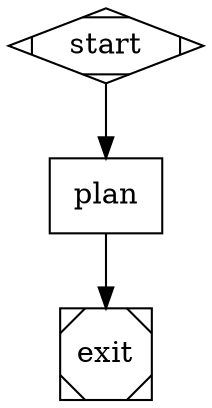
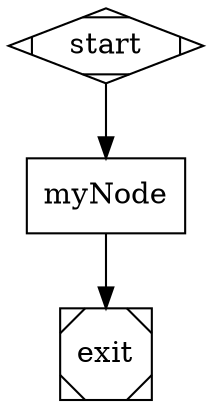

# Attractor

A DAG pipeline execution engine. Define pipelines as DOT files; run them with Claude Code as the execution backend.

## DAG File Syntax

Pipeline graphs are written in a subset of the [Graphviz DOT language](https://graphviz.org/doc/info/lang.html).

### Comments

Both line and block comments are supported and are stripped before parsing.



Comments may appear:
- Between node or edge declarations
- Inline after any attribute value
- Inside attribute blocks `[...]`
- Spanning multiple lines (block comments only)

### Basic Structure



### Node Shapes

| Shape       | Meaning              |
|-------------|----------------------|
| `Mdiamond`  | Start node           |
| `Msquare`   | Exit node            |
| `box`       | Codergen (LLM) node  |
| `component` | Parallel fan-out     |
| `diamond`   | Conditional router   |
| `oval`      | Tool execution node  |

## CLI

```
attractor run <dotfile> [options]
attractor validate <dotfile>
attractor visualize <dotfile>
```

### Run Options

| Flag                        | Description                                              |
|-----------------------------|----------------------------------------------------------|
| `--cwd <path>`              | Working directory for tool/codergen execution            |
| `--resume <checkpoint>`     | Resume from an explicit checkpoint file                  |
| `--resume-last`             | Resume from the most recent run's checkpoint             |
| `--log-dir <path>`          | Directory for run logs (default: `.attractor/runs/`)     |
| `--verbose`                 | Emit all SDK events to stderr                            |
